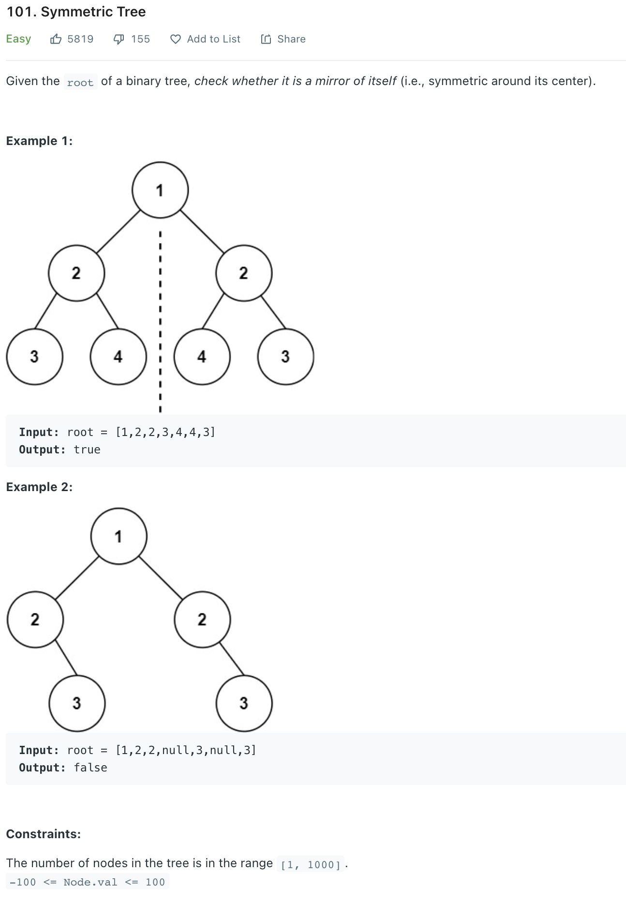

##101. Symmetric Tree - Easy - https://leetcode.com/problems/symmetric-tree/

###Solution - Recursive - TC: O(N), SC: O(N)
####Time complexity : O(n). Because we traverse the entire input tree once, the total run time is O(n)O(n), where nn is the total number of nodes in the tree.
####Space complexity : The number of recursive calls is bound by the height of the tree. In the worst case, the tree is linear and the height is in O(n). Therefore, space complexity due to recursive calls on the stack is O(n)O(n) in the worst case.
```
    public boolean isSymmetric(TreeNode root) {
        return recur(root.left, root.right);
    }

    private boolean recur(TreeNode left, TreeNode right) {
        if (left == null && right == null) return true;
        if (left == null || right == null) return false;
        return (left.val == right.val) && recur(left.left, right.right) && recur(left.right, right.left);
    }

    static class TreeNode {
        int val;
        TreeNode left, right;
    }
```
###Solution - Iterative - TC: O(N), SC: O(N) - Because we traverse the entire input tree once, There is additional space required for the search queue.
```
    public boolean isSymmetric(TreeNode root) {
        // Cannot use ArrayDeque, because ArrayDeque does not allow null to be inserted
        Queue<TreeNode> queue = new LinkedList<>();
        queue.add(root.left);
        queue.add(root.right);
        while (!queue.isEmpty()) {
            TreeNode left = queue.poll();
            TreeNode right = queue.poll();
            if (left == null && right == null) continue;
            if (left == null || right == null || left.val != right.val) return false;
            queue.add(left.left);
            queue.add(right.right);
            queue.add(left.right);
            queue.add(right.left);
        }
        return true;
    }
```