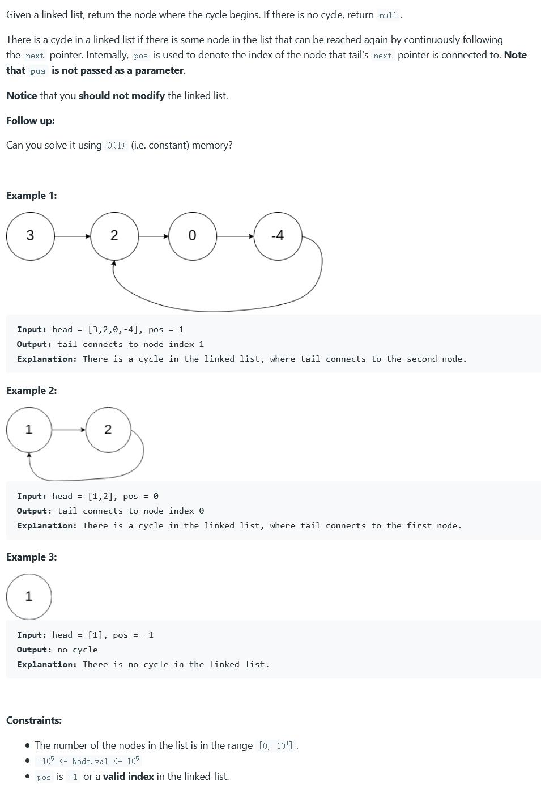

##142. Linked List Cycle II - medium - https://leetcode.com/problems/linked-list-cycle-ii/

###Solution - Slow-Fast Pointers - TC: O(n), SC: O(1)
###Round 1 - Fast Pointer: 2 nodes/step, Slow: 1 node/step
###Round 2 - Fast Pointer return to 0 and 1 node/step, Slow: 1 node/step, they will meet at the start node of the loop 
###refer: https://leetcode-cn.com/problems/linked-list-cycle-ii/solution/linked-list-cycle-ii-kuai-man-zhi-zhen-shuang-zhi-/
```
    public ListNode detectCycle(ListNode head) {
        ListNode fast = head, slow = head;
        //round 1 - fast at speed 2, slow at 1
        while (true) {
            if (fast == null || fast.next == null) return null;
            fast = fast.next.next;
            slow = slow.next;
            if (fast == slow) break;
        }
        //round 2 - fast return to 0 and speed at 1
        fast = head;
        while (slow != fast) {
            slow = slow.next;
            fast = fast.next;
        }
        return fast;
    }
```