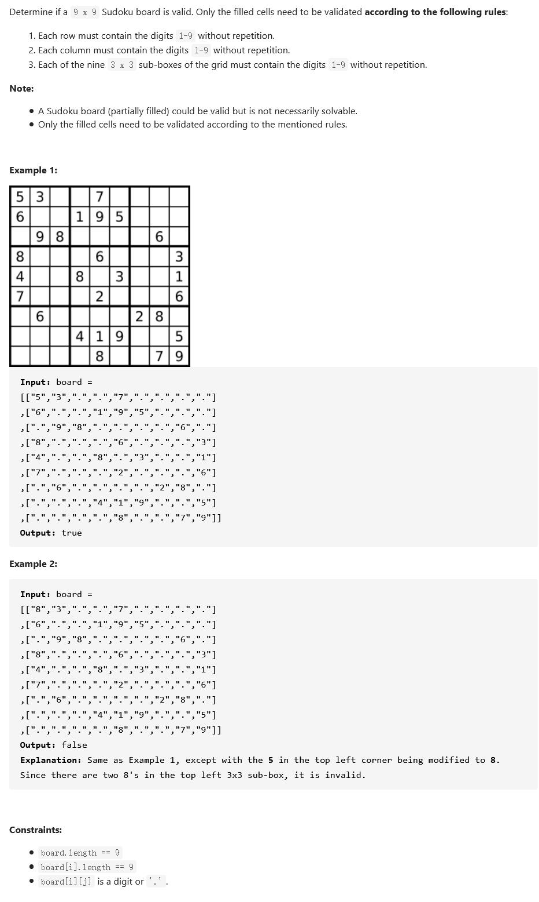

##36. Valid Sudoku - medium - https://leetcode.com/problems/valid-sudoku/

##Solution - Iteration one time(81 cells) - TC: O(1), SC: O(1), but String operation is slow

```
    public boolean isValidSudoku(char[][] board) {
        if (board == null || board.length == 0) return false;
        Set<String> set = new HashSet<>();
        for (int i = 0; i < 9; i++) {
            for (int j = 0; j < 9; j++) {
                char num = board[i][j];
                if (num != '.') {
                    if (!set.add(num + " in Row " + i)  // add row mark
                            || !set.add(num + " in Column " + j) // add column mark
                            || !set.add(num + " in Box " + i / 3 + "-" + j / 3) // add box mark
                    ) {
                        //if any mark failed, which means there is repeated number
                        return false;
                    }
                }
            }
        }
        return true;
    }
    
    //(Improved Version) much faster than string operation
    public boolean isValidSudoku(char[][] board) {
        int n = board.length;
        // 9 rows, 9 cols, 9 boxes
        Set<Integer>[] rows = new HashSet[n];
        Set<Integer>[] cols = new HashSet[n];
        Set<Integer>[] boxes = new HashSet[n];
        for (int i = 0; i < n; i++) {
            rows[i] = new HashSet<>();
            cols[i] = new HashSet<>();
            boxes[i] = new HashSet<>();
        }

        for (int i = 0; i < n; i++) {
            for (int j = 0; j < n; j++) {
                if (board[i][j] == '.') continue;
                int num = board[i][j] - '0';
                int bIndex = i / 3 * 3 + j / 3; // calculate box index
                if (rows[i].contains(num) || cols[j].contains(num) || boxes[bIndex].contains(num))
                    return false;
                rows[i].add(num);
                cols[j].add(num);
                boxes[bIndex].add(num);
            }
        }
        return true;
    }
```

