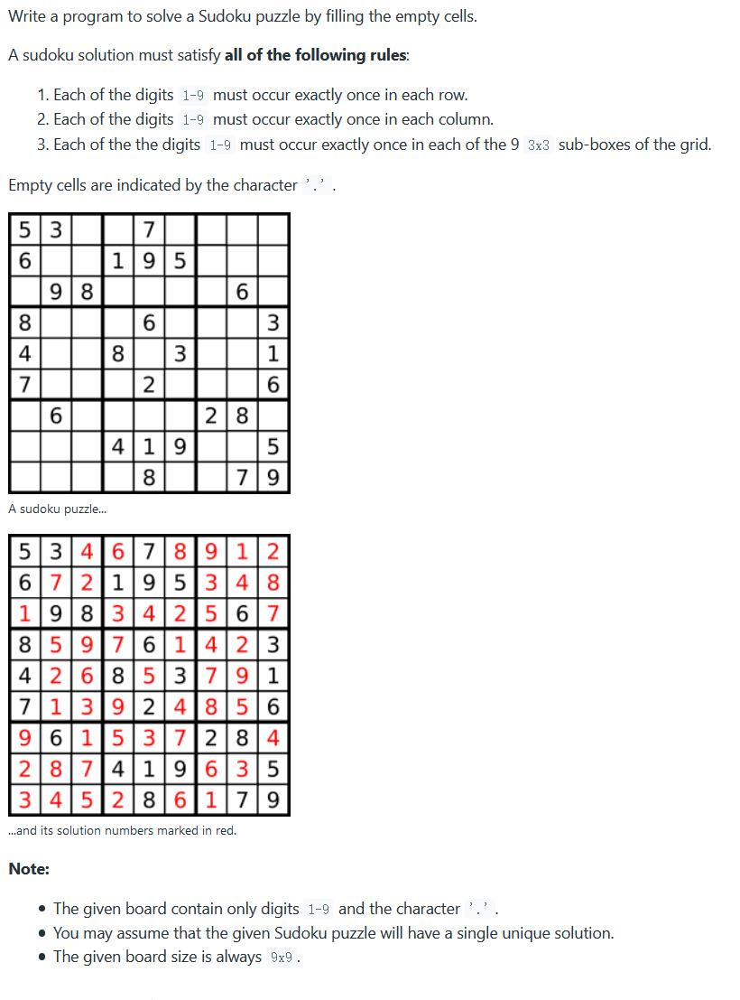

##37. Sudoku Solver - hard - https://leetcode.com/problems/sudoku-solver/

##Solution - DFS & Backtrack - TC: 
##https://leetcode.com/problems/sudoku-solver/discuss/15752/Straight-Forward-Java-Solution-Using-Backtracking

```
    public void solveSudoku(char[][] board) {
        backtrack(board, 0, 0);
    }

    private boolean backtrack(char[][] board, int x, int y) {
        if (x == 9)
            return true;
        if (board[x][y] != '.')
            return backtrack(board, y == 8 ? x + 1 : x, y == 8 ? 0 : y + 1);
        for (char c = '1'; c <= '9'; c++) {
            if (isValid(board, x, y, c)) {
                board[x][y] = c;
                if (backtrack(board, y == 8 ? x + 1 : x, y == 8 ? 0 : y + 1))
                    return true;
                // set back state
                board[x][y] = '.';
            }
        }
        return false;
    }

    private boolean isValid(char[][] board, int i, int j, char c) {
        for (int k = 0; k < 9; k++) {
            if (board[k][j] == c) return false; // check column
            if (board[i][k] == c) return false; // check row
            int boxR = i / 3 * 3 + k / 3;
            int boxC = j / 3 * 3 + k % 3;
            if (board[boxR][boxC] == c) return false; // check box
        }
        return true;
    }
```