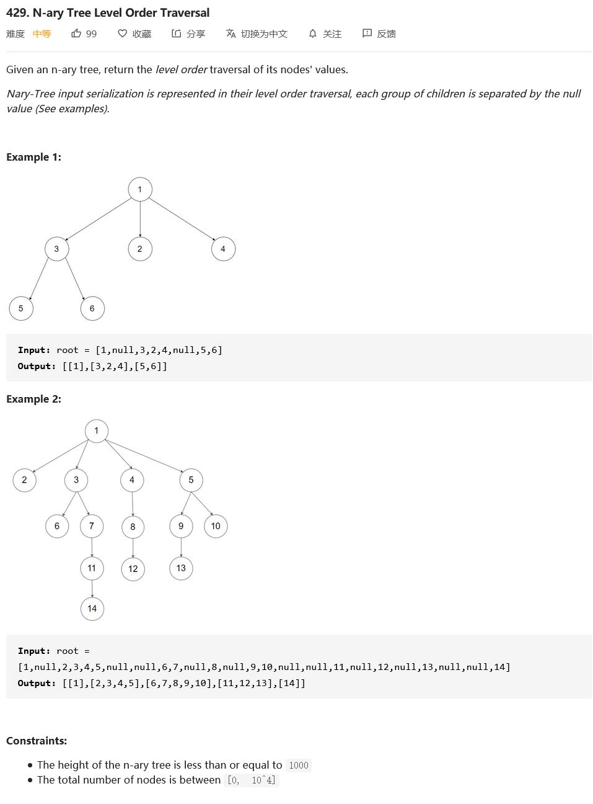

##429. N-ary Tree Level Order Traversal - medium - https://leetcode.com/problems/n-ary-tree-level-order-traversal/

```
    class Node {
        public int val;
        public List<Node> children;

        public Node() {
        }

        public Node(int _val) {
            val = _val;
        }

        public Node(int _val, List<Node> _children) {
            val = _val;
            children = _children;
        }
    }
```

##Solution 1 - Iteration(BFS) - TC: O(N), SC: O(N)
```
    public List<List<Integer>> levelOrder(Node root) {
        List<List<Integer>> result = new ArrayList<>();
        if (root == null) return result;
        LinkedList<Node> deque = new LinkedList<>();
        deque.addLast(root);
        while (!deque.isEmpty()) {
            ArrayList<Integer> tmp = new ArrayList<>();
            int size = deque.size();
            for (int i = 0; i < size; i++) {
                Node node = deque.pollFirst();
                tmp.add(node.val);
                if (node.children != null && !node.children.isEmpty()) {
                    for(Node child: node.children){
                        deque.addLast(child);
                    }
                }
            }
            result.add(tmp);
        }
        return result;
    }
```
##Solution 2 - Recursion(DFS) - TC: O(N), SC: O(N)
```
    public List<List<Integer>> levelOrder(Node root) {
        List<List<Integer>> list = new ArrayList<>();
        if (root == null) return list;
        levelOrder(root, 0, list);
        return list;
    }
    
    private void levelOrder(Node node, int depth, List<List<Integer>> list){
        if(node == null) return;
        if(depth + 1 > list.size()){
            list.add(new ArrayList<>());
        }
        
        list.get(depth).add(node.val);
        for(Node child: node.children){
            levelOrder(child, depth + 1, list);
        }
    }
```