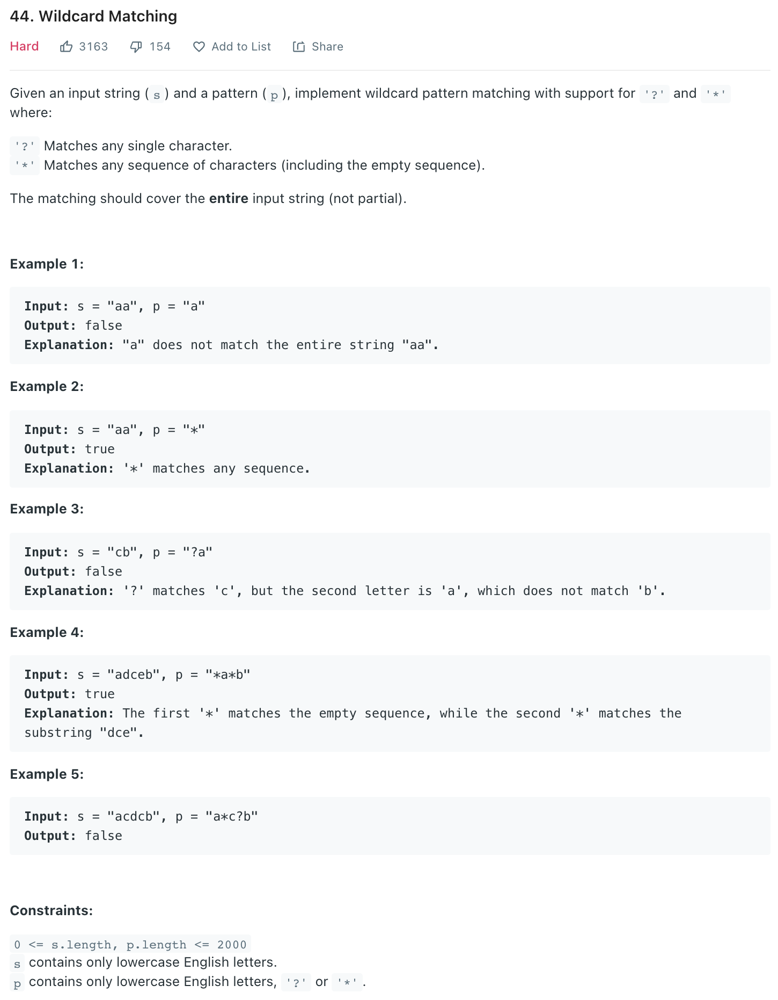

##44. Wildcard Matching - hard - https://leetcode.com/problems/wildcard-matching/

####Refer: https://leetcode-cn.com/problems/wildcard-matching/solution/dong-tai-gui-hua-dai-zhu-shi-by-tangweiqun/
```
    public boolean isMatch(String s, String p) {
        char[] sChs = s.toCharArray();
        char[] pChs = p.toCharArray();
        int m = sChs.length;
        int n = pChs.length;

        // 状态 dp[i][j] : 表示 s 的前 i 个字符和 p 的前 j 个字符是否匹配
        boolean[][] dp = new boolean[m + 1][n + 1];

        // 初始化
        dp[0][0] = true;
        for (int i = 1; i <= n; i++) {
            dp[0][i] = dp[0][i - 1] && pChs[i - 1] == '*';
        }

        // 状态转移
        for (int i = 1; i <= m; i++) {
            for (int j = 1; j <= n; j++) {
                if (sChs[i - 1] == pChs[j - 1] || pChs[j - 1] == '?') {
                    dp[i][j] = dp[i - 1][j - 1];
                } else if (pChs[j - 1] == '*') {
                    dp[i][j] = dp[i][j - 1] || dp[i - 1][j];
                }
            }
        }

        // 返回结果
        return dp[m][n];

    }
```