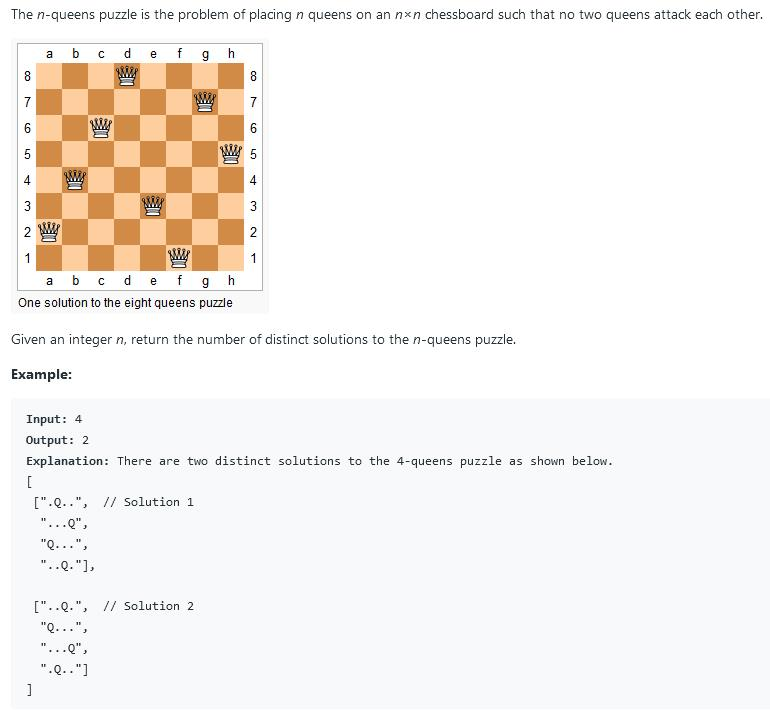

##52. N-Queens II - hard - https://leetcode.com/problems/n-queens-ii/

##Solution 1 - DFS - TC: O(N!)
```
    private int count;
    public int totalNQueens(int n) {
        char[][] board = new char[n][n];
        for (int i = 0; i < board.length; i++)
            Arrays.fill(board[i], '.');
        dfs(board, 0);
        return count;
    }

    private void dfs(char[][] board, int row) {
        // terminator
        if (row == board.length) {
            count++;
            return;
        }

        for (int i = 0; i < board.length; i++) {
            if (isValid(board, row, i)) {
                board[row][i] = 'Q';
                dfs(board, row + 1);
                board[row][i] = '.';
            }
        }
    }

    private boolean isValid(char[][] board, int row, int col) {
        // validate top
        for (int i = 0; i < row; i++) if (board[i][col] == 'Q') return false;
        // validate top-left
        for (int i = row - 1, j = col - 1; i >= 0 && j >= 0; i--, j--)
            if (board[i][j] == 'Q') return false;
        // validate top-right
        for (int i = row - 1, j = col + 1; i >= 0 && j < board.length; i--, j++)
            if (board[i][j] == 'Q') return false;
        return true;
    }
```
##Solution 2 - Bit Operation(faster than DFS) - TC: O(N!)
```
    private int size;
    private int count;

    public int totalNQueens(int n) {
        count = 0;
        size = (1 << n) - 1;
        solve(0, 0, 0);
        return count;
    }

    private void solve(int row, int ld, int rd) {
        if (row == size) {
            count++;
            return;
        }
        int pos = size & (~(row | ld | rd));
        while (pos != 0) {
            int p = pos & (-pos);
            pos -= p; // pos &= pos -1
            solve(row | p, (ld | p) << 1, (rd | p) >> 1);
        }
    }
```