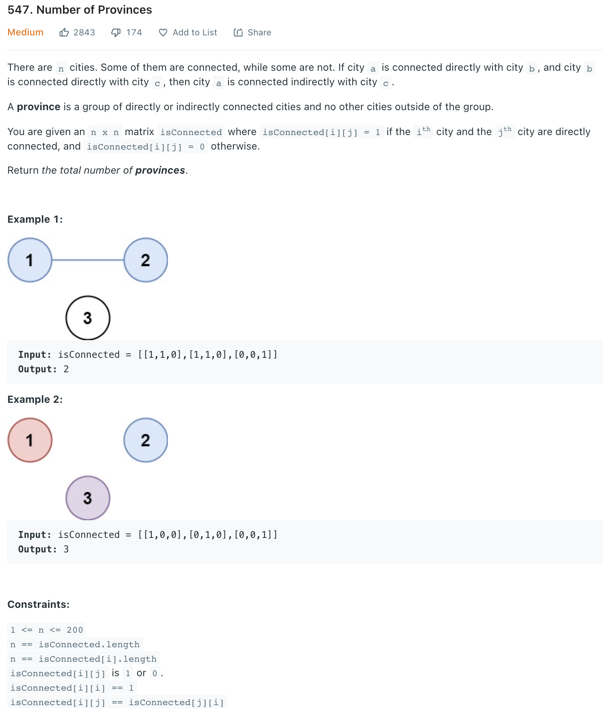

##547. Number of Provinces - medium - https://leetcode.com/problems/number-of-provinces/

###Solution 1 - Disjoint Sets(Union-Find) - TC: O(N^2 logN), SC: O(N)
###https://leetcode-cn.com/problems/friend-circles/solution/union-find-suan-fa-xiang-jie-by-labuladong/
```
    public int findCircleNum(int[][] M) {
        int n = M.length;
        UF uf = new UF(n);
        for (int i = 0; i < n; i++) {
            for (int j = 0; j < i; j++) {
                if (M[i][j] == 1)
                    uf.union(i, j);
            }
        }

        return uf.count();
    }

    class UF {
        // 记录连通分量个数
        private int count;
        // 存储若干棵树
        private int[] parent;
        // 记录树的“重量”
        private int[] size;

        public UF(int n) {
            this.count = n;
            parent = new int[n];
            size = new int[n];
            for (int i = 0; i < n; i++) {
                parent[i] = i;
                size[i] = 1;
            }
        }

        /* 将 p 和 q 连通 */
        // TC: O(log N)
        public void union(int p, int q) {
            int rootP = find(p);
            int rootQ = find(q);
            if (rootP == rootQ)
                return;

            // 小树接到大树下面，较平衡
            if (size[rootP] > size[rootQ]) {
                parent[rootQ] = rootP;
                size[rootP] += size[rootQ];
            } else {
                parent[rootP] = rootQ;
                size[rootQ] += size[rootP];
            }
            count--;
        }

        /* 判断 p 和 q 是否互相连通 */
        public boolean connected(int p, int q) {
            int rootP = find(p);
            int rootQ = find(q);
            // 处于同一棵树上的节点，相互连通
            return rootP == rootQ;
        }

        /* 返回节点 x 的根节点 */
        private int find(int x) {
            while (parent[x] != x) {
                // 进行路径压缩
                parent[x] = parent[parent[x]];
                x = parent[x];
            }
            return x;
        }

        public int count() {
            return count;
        }
    }
```
###Solution 2 - DFS - TC: O(n^2), SC: O(N) - Be careful: cannot use the method in 200. Number of Islands
###https://leetcode-cn.com/problems/friend-circles/solution/peng-you-quan-by-leetcode/
```
    public int findCircleNum(int[][] M) {
        // visited will traverse person from (0...i) to find each one's friends
        // when finished traverse, visited will be all 1s
        int[] visited = new int[M.length];
        int count = 0;
        for (int i = 0; i < M.length; i++) {
            if (visited[i] == 0) {
                dfs(M, visited, i); // find all direct or indirect connection with i 
                count++;
            }
        }
        return count;
    }

    private void dfs(int[][] M, int[] visited, int i) {
        for (int j = 0; j < M.length; j++) {
            if (M[i][j] == 1 && visited[j] == 0) {
                visited[j] = 1;
                dfs(M, visited, j);
            }
        }
    }
    
    /*
        or: BFS
    */
    public int findCircleNum(int[][] isConnected) {
        int provinces = isConnected.length;
        boolean[] visited = new boolean[provinces];
        int circles = 0;
        Queue<Integer> queue = new LinkedList<Integer>();
        for (int i = 0; i < provinces; i++) {
            if (!visited[i]) {
                queue.offer(i);
                while (!queue.isEmpty()) {
                    int j = queue.poll();
                    visited[j] = true;
                    for (int k = 0; k < provinces; k++) {
                        if (isConnected[j][k] == 1 && !visited[k]) {
                            queue.offer(k);
                        }
                    }
                }
                circles++;
            }
        }
        return circles;
    }
```