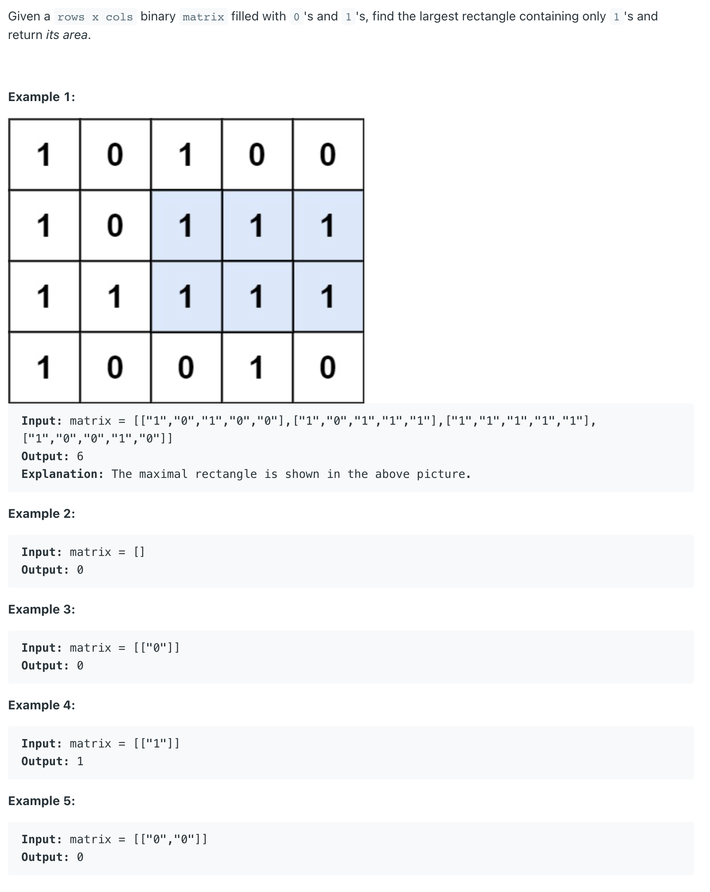

##85. Maximal Rectangle - hard - https://leetcode.com/problems/maximal-rectangle/


###Solution - Brute Force -  TC: O(m^2 n), SC: O(mn)
###https://leetcode-cn.com/problems/maximal-rectangle/solution/xiang-xi-tong-su-de-si-lu-fen-xi-duo-jie-fa-by-1-8/
```
    public int maximalRectangle(char[][] matrix) {
        if (matrix.length == 0) return 0;
        int m = matrix.length, n = matrix[0].length;
        int[][] dp = new int[m][n];
        int max = 0;

        for (int i = 0; i < m; i++) {
            for (int j = 0; j < n; j++) {
                if (matrix[i][j] == '1') {
                    if (j == 0) {
                        dp[i][j] = 1;
                    } else {
                        dp[i][j] = dp[i][j - 1] + 1;
                    }
                }
                // record the min number in the row
                int minWidth = dp[i][j];
                // find the row with the min number
                for (int k = i; k >= 0; k--) {
                    int height = i - k + 1;
                    minWidth = Math.min(minWidth, dp[k][j]);
                    max = Math.max(max, height * minWidth);
                }
            }
        }

        return max;
    }
```

###Solution - Stack - TC: O(m n), TC:O(n) - similar to 84. Largest Rectangle in Histogram
###https://leetcode-cn.com/problems/maximal-rectangle/solution/xiang-xi-tong-su-de-si-lu-fen-xi-duo-jie-fa-by-1-8/
```
    public int maximalRectangle(char[][] matrix) {
        if (matrix.length == 0 || matrix[0].length == 0) return 0;
        int m = matrix.length, n = matrix[0].length, max = 0;
        int[] heights = new int[matrix[0].length + 2]; // add sentinel on the left & right side
        for (int i = 0; i < m; i++) {
            for (int j = 0; j < n; j++) {
                if (matrix[i][j] == '1') {
                    // sentinel 0 was added on the left boundary
                    heights[j + 1] += 1;
                } else {
                    heights[j + 1] = 0;
                }
            }
            max = Math.max(max, largestRectangleArea(heights));
        }
        return max;
    }

    // suppose sentinels are added on the left and right sides
    private int largestRectangleArea(int[] heights) {
        Stack<Integer> stack = new Stack<>();
        int area = 0;
        for (int i = 0; i < heights.length; i++) {
            // find right boundary is i, left boundary is stack.peek()
            while (!stack.empty() && heights[i] < heights[stack.peek()]) {
                int popIndex = stack.pop();
                area = Math.max(area, heights[popIndex] * (i - stack.peek() - 1));
            }
            stack.push(i);
        }
        return area;
    }
```
