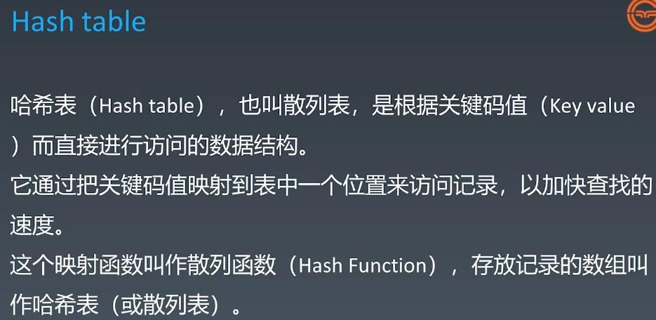
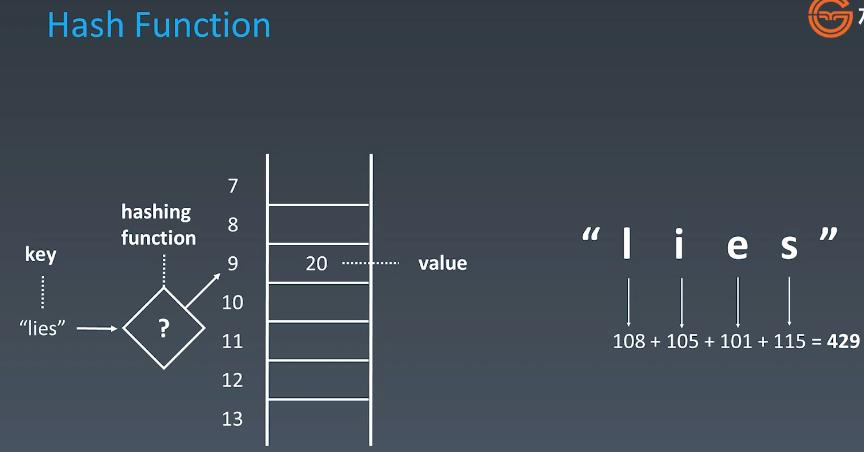
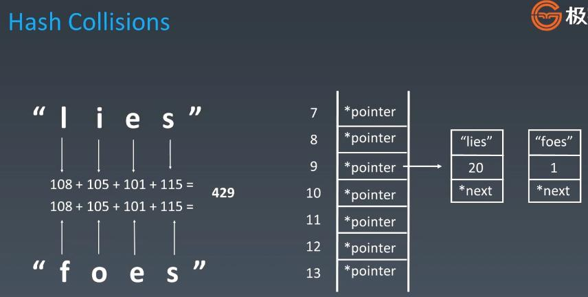
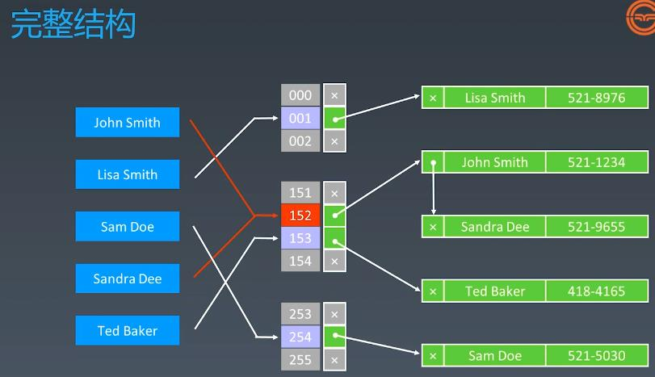
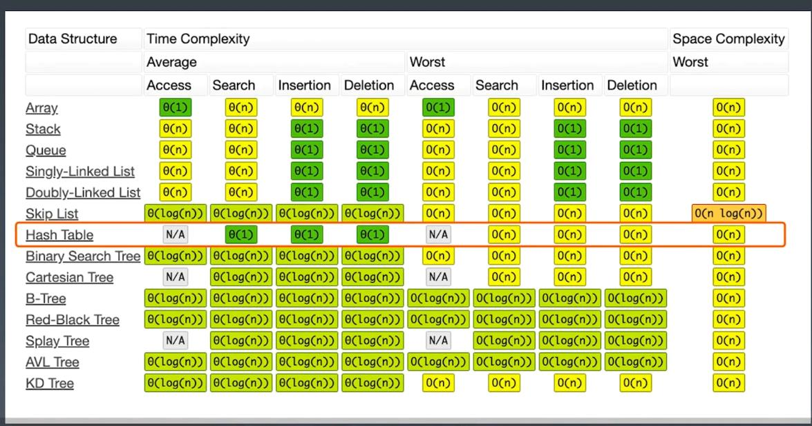
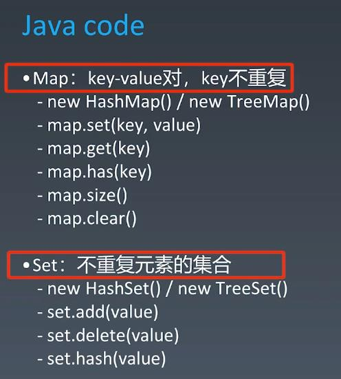

#Hash Table, Map, Set
  
###Hash Table application: Telephone Number Book, sLRU Cache, Redis

###How it works: hashFunc("lies") => 429 % 10 => 9, save "lies" on position 9

###Handle Hash Collision: increase dimension by add a LinkedList 

###Full Structure

###TC Compare: Hash Table Worst situation happens when bad hashFunc or small capacity

###Java: HashSet internally use HashMap

  
###Leetcode: 
####242. Valid Anagram - easy - https://leetcode.com/problems/valid-anagram/
####49. Group Anagrams - medium - https://leetcode.com/problems/group-anagrams/
####1. Two Sum - easy - https://leetcode.com/problems/two-sum/