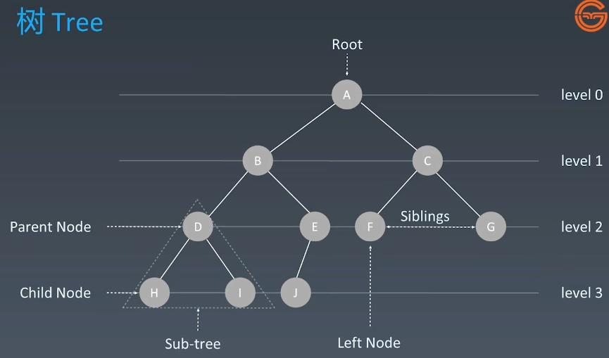
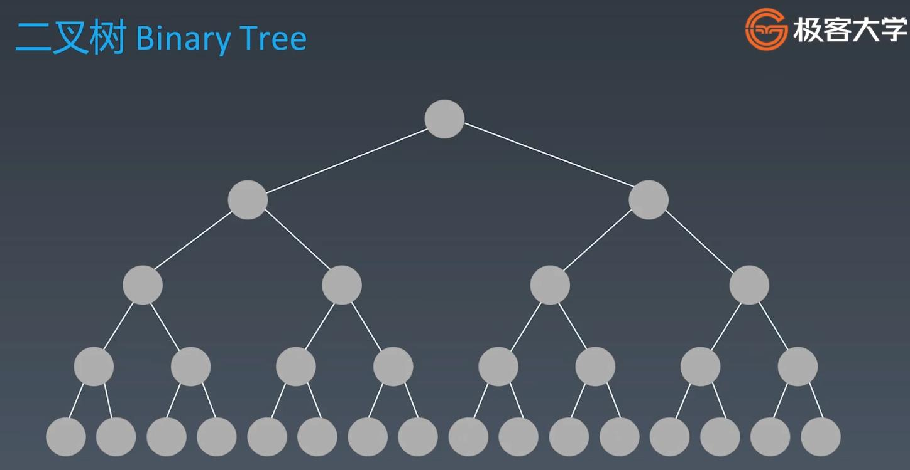
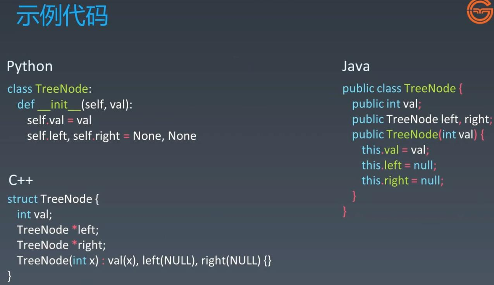
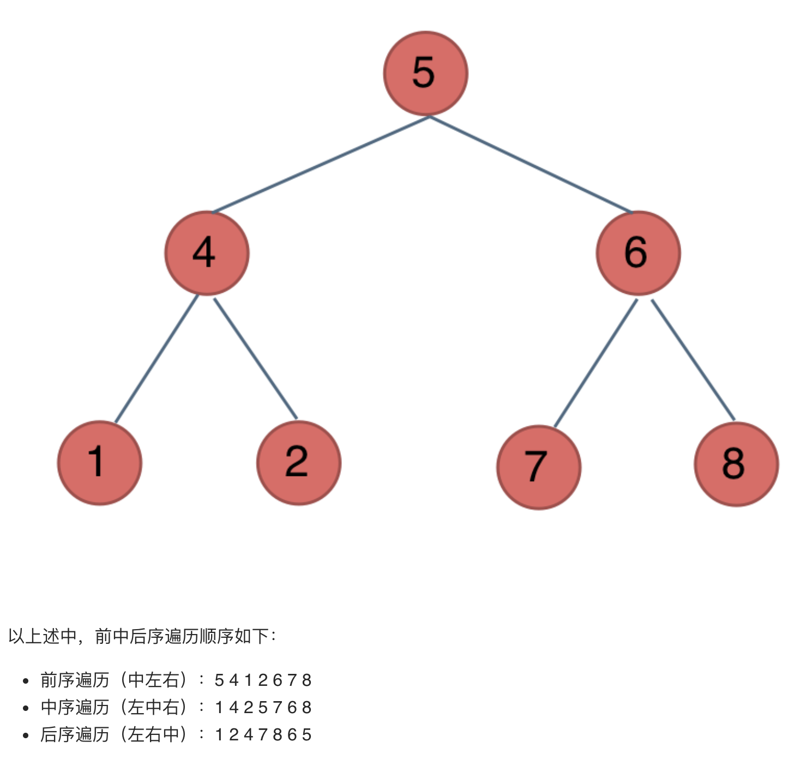
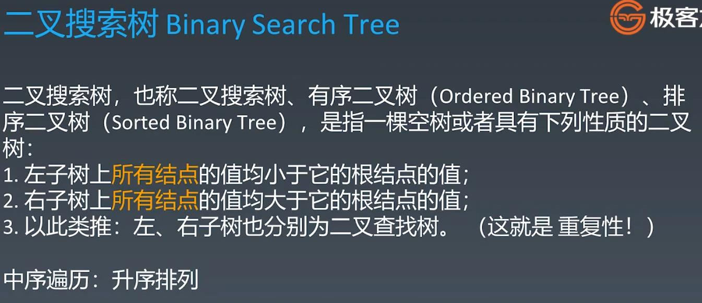
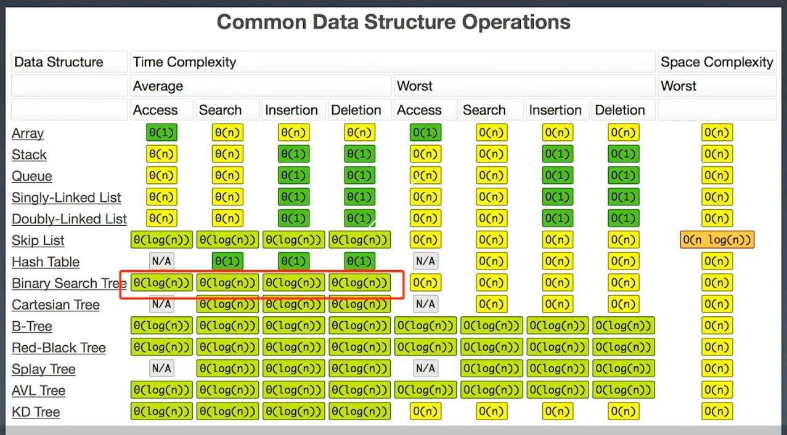

#Tree, Binary Tree, Binary Search Tree
  
##Tree
###Search in linked list is O(N), to improve it we have to increase its dimension, then it becomes a tree, then search becomes O(logN)

###Binary Tree - each node will have less than 2 child nodes

###Graph - there is loop in the tree

###Tree Node Code

###Fibannaci Recursive Tree

###Binary Tree Traversal

###Pay Attention - Binary Tree Traversal Order Graph

  
###Binary Search Tree - Inorder Traversal - sorted values ascending order 
####Search/Insert: O(logN)

###Binary Search Tree TC

  
###Leetcode
####94. Binary Tree Inorder Traversal - medium - https://leetcode.com/problems/binary-tree-inorder-traversal/
####144. Binary Tree Preorder Traversal - medium - https://leetcode.com/problems/binary-tree-preorder-traversal/
####145. Binary Tree Postorder Traversal - medium - https://leetcode.com/problems/binary-tree-postorder-traversal/
####102. Binary Tree Level Order Traversal - medium - https://leetcode.com/problems/binary-tree-level-order-traversal/
####590. N-ary Tree Postorder Traversal - easy - https://leetcode.com/problems/n-ary-tree-postorder-traversal/
####589. N-ary Tree Preorder Traversal - easy - https://leetcode.com/problems/n-ary-tree-preorder-traversal/
####429. N-ary Tree Level Order Traversal - medium - https://leetcode.com/problems/n-ary-tree-level-order-traversal/
####101. Symmetric Tree - Easy - https://leetcode.com/problems/symmetric-tree/
####207. Course Schedule - Medium - https://leetcode.com/problems/course-schedule/
  
###Did the code, but not included in the project
####103. Binary Tree Zigzag Level Order Traversal - medium - https://leetcode.com/problems/binary-tree-zigzag-level-order-traversal/
####124. Binary Tree Maximum Path Sum - hard - https://leetcode.com/problems/binary-tree-maximum-path-sum/
####236. Lowest Common Ancestor of a Binary Tree - Medium - https://leetcode.com/problems/lowest-common-ancestor-of-a-binary-tree/
####543. Diameter of Binary Tree - Easy - https://leetcode.com/problems/diameter-of-binary-tree/
