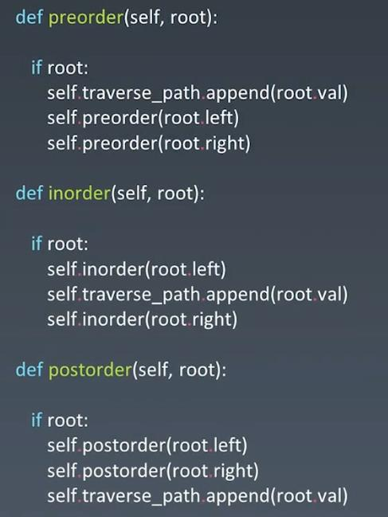
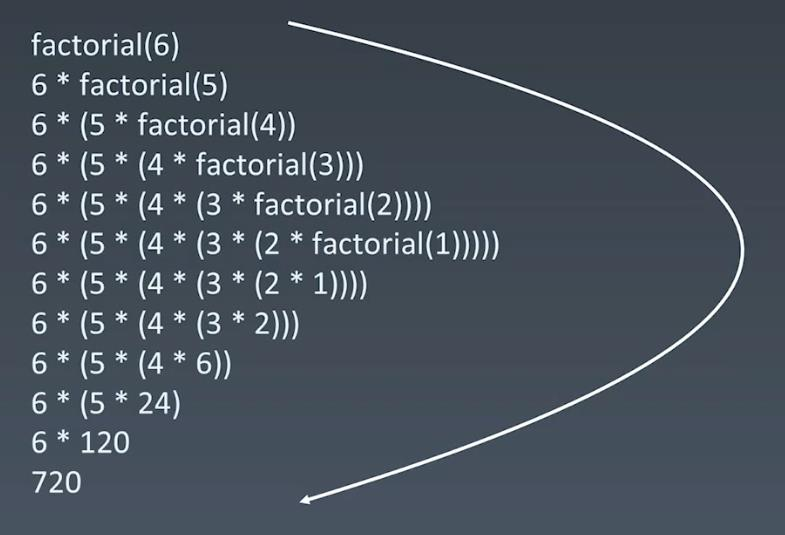

##Recursion - DFS
###Tree Recursion - Preorder(root-left-right), Inorder(left-root-right), Postorder(left-right-root)
<br></br>
###Fibonnaci
<br></br>
<br></br>
### Code Template:
```
function recursion(params){
    // terminator
        ...
    // process current logic
        ...
    // drill down
       recursion(...)
    // revert state
       ...
}
```
<br></br>
###Recursion - Always think about code/logic repeatability instead of Brute Force
<br></br>
###LeetCode
####70. Climbing Stairs - Easy - https://leetcode.com/problems/climbing-stairs/
####22. Generate Parentheses - Medium -- https://leetcode.com/problems/generate-parentheses/
####226. Invert Binary Tree - Easy - https://leetcode.com/problems/invert-binary-tree/description/
####98. Validate Binary Search Tree - Medium - https://leetcode.com/problems/validate-binary-search-tree/
####104. Maximum Depth of Binary Tree - easy - https://leetcode.com/problems/maximum-depth-of-binary-tree/
####111.Minimum Depth of Binary Tree - easy - https://leetcode.com/problems/minimum-depth-of-binary-tree
####297. Serialize and Deserialize Binary Tree - hard - https://leetcode.com/problems/serialize-and-deserialize-binary-tree/