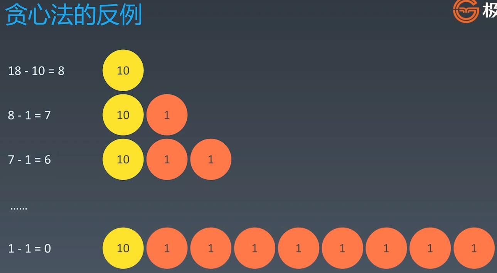

##Greed Algorithm
  
### What is Greedy Algorithm

  
  
### Usage

  
  
### EG: https://leetcode-cn.com/problems/coin-change/
### When: coins=[20, 10, 5, 1], what is the minimum combination to form: total = 36 

  
  
### but greedy is not suitable for all coins combination

  
  
### When to use greedy algorithm

  
  
### Leetcode:
####322. Coin Change - medium - https://leetcode.com/problems/coin-change/
####55. Jump Game - medium - https://leetcode.com/problems/jump-game/
####122. Best Time to Buy and Sell Stock II - easy - https://leetcode.com/problems/best-time-to-buy-and-sell-stock-ii/
####455. Assign Cookies - easy - https://leetcode.com/problems/assign-cookies/
####874. Walking Robot Simulation - easy - https://leetcode.com/problems/walking-robot-simulation/
####45. Jump Game II - hard - https://leetcode.com/problems/jump-game-ii/
####12. Integer to Roman - medium - https://leetcode.com/problems/integer-to-roman/
