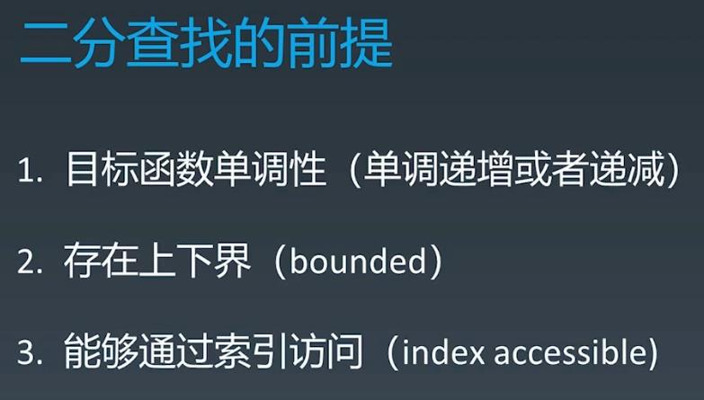

##Binary Search
###To use Binary Search, the items must be sorted otherwise it can only be traversed

  
  
####69. Sqrt(x) - easy - https://leetcode.com/problems/sqrtx/
####33. Search in Rotated Sorted Array - medium - https://leetcode.com/problems/search-in-rotated-sorted-array/
####74. Search a 2D Matrix - medium - https://leetcode.com/problems/search-a-2d-matrix/
####367. Valid Perfect Square - easy - https://leetcode.com/problems/valid-perfect-square/
####153. Find Minimum in Rotated Sorted Array - medium - https://leetcode.com/problems/find-minimum-in-rotated-sorted-array/
####34. Find First and Last Position of Element in Sorted Array - medium - https://leetcode.com/problems/find-first-and-last-position-of-element-in-sorted-array/

###On Leetcode Only
####116. Populating Next Right Pointers in Each Node - medium - https://leetcode.com/problems/populating-next-right-pointers-in-each-node/
####117. Populating Next Right Pointers in Each Node II - medium - https://leetcode.com/problems/populating-next-right-pointers-in-each-node-ii/
####235. Lowest Common Ancestor of a Binary Search Tree - easy - https://leetcode.com/problems/lowest-common-ancestor-of-a-binary-search-tree/