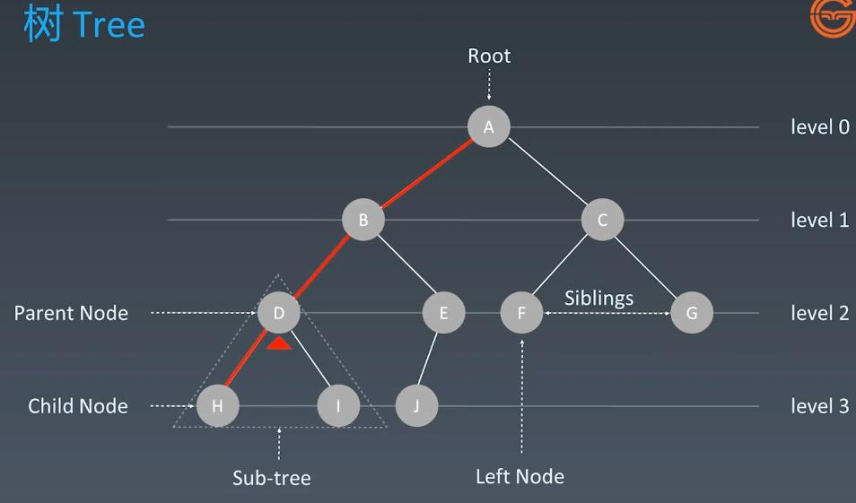
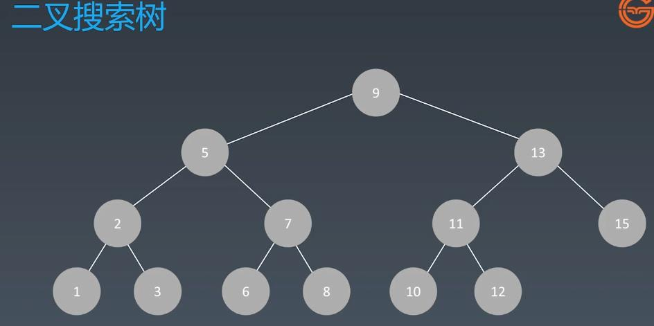
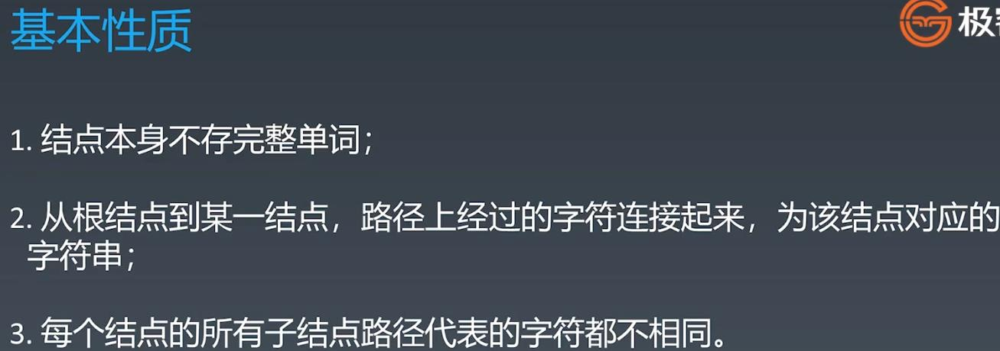
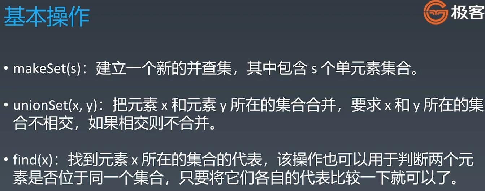
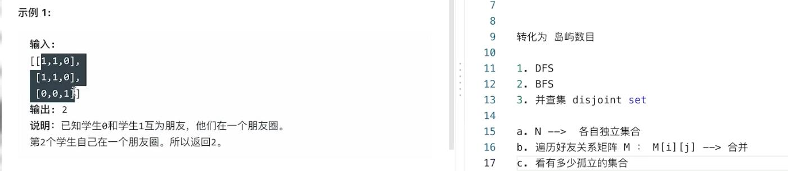
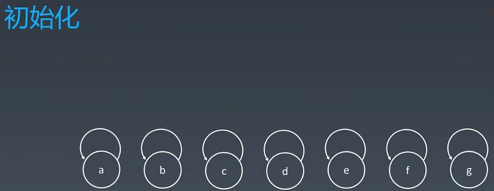
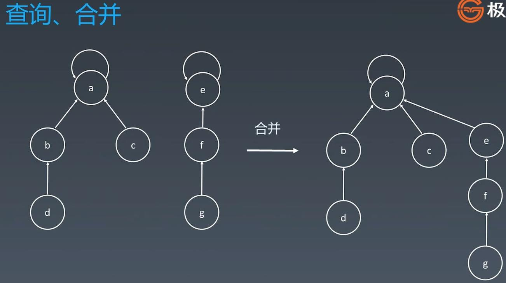

##Trie(前缀树/字典树) & Disjoint Sets(Union-Find)
##Tree Structure - DFS vs BFS

##Binary Tree - sub nodes on the left < node < sub nodes on the right

##Binary Tree Data Structure is not able to handle search engine, we need new Data Structure - Trie

##Trie(字典树)
####E.g: search "ten" -> search "t" -> search "e" -> search "n" => the path will form "ten" 

###每个节点可能存储额外的信息，例如单词搜频率


###Trie - Core Think - which natively solves search engine problem

##Leetcode:
####208. Implement Trie (Prefix Tree) - medium - https://leetcode.com/problems/implement-trie-prefix-tree/
####212. Word Search II - hard - https://leetcode.com/problems/word-search-ii/


<br></br>
<br></br>
##Disjoint Sets(Union-Find 并查集) - Group or not?(组团，配对的问题)

##Example - 547. Friend Circles, 200. Number of Islands
####0, 1, 2 represent 3 persons, f(0, 1) = 1 => 0 and 1 is in the same set

<br></br>
###Initialize each element with parent element point to itself -> the node itself is the parent

###Search: find the leading(parent) node of the set
###Combine: parent(e) -> a or parent(a) -> e

###Can optimize search by path compression: point all sub nodes direct parents to be a

```
Code Sample:
    class UnionFind {
    private int count = 0; // number of union set
    private int[] parent;

    public UnionFind(int n) {
        count = n;
        parent = new int[n];
        for (int i = 0; i < n; i++) {
            parent[i] = i; //init all node's parent to itself
        }
    }

    // find the leading element in the set
    public int find(int p) {
        while (p != parent[p]) { // leading element => p == parent[p]
            // path compression
            parent[p] = parent[parent[p]];
            p = parent[p];
        }
        return p;
    }

    public void union(int p, int q) {
        int rootP = find(p);
        int rootQ = find(q);
        if (rootP == rootQ) return;
        parent[rootP] = rootQ;
        //the number independent sets will minus -1
        count--;
    }
}
```
<br></br>
###Leetcode
####547. Friend Circles - medium - https://leetcode.com/problems/friend-circles/
####200. Number of Islands - medium - https://leetcode.com/problems/number-of-islands/
####130. Surrounded Regions - medium - https://leetcode.com/problems/surrounded-regions/
