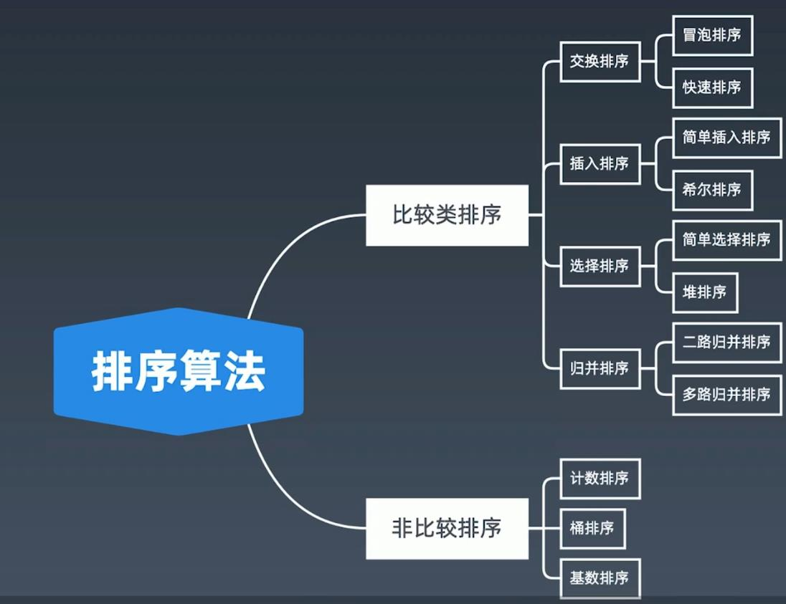
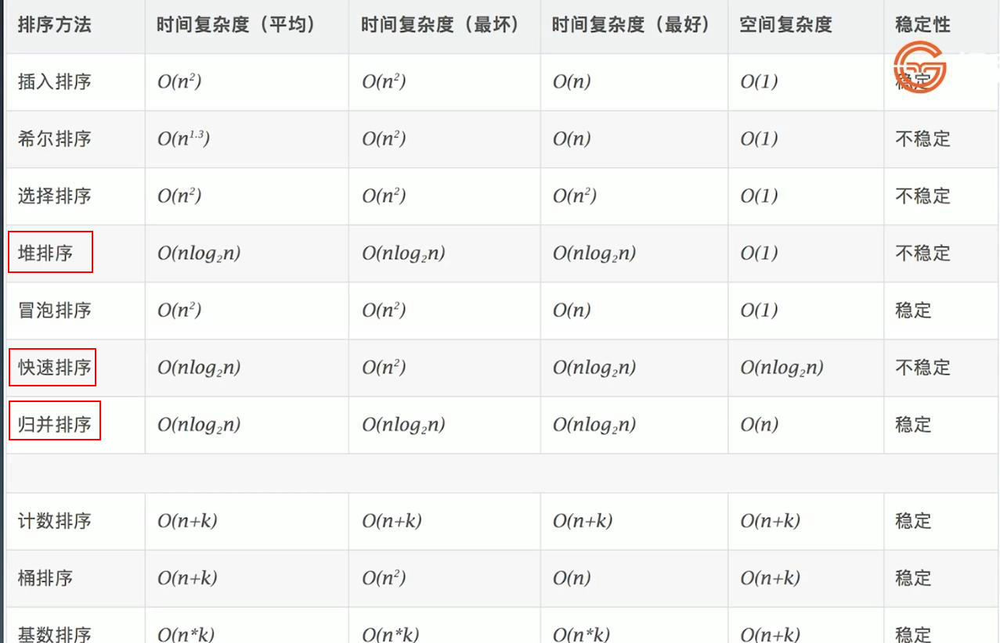
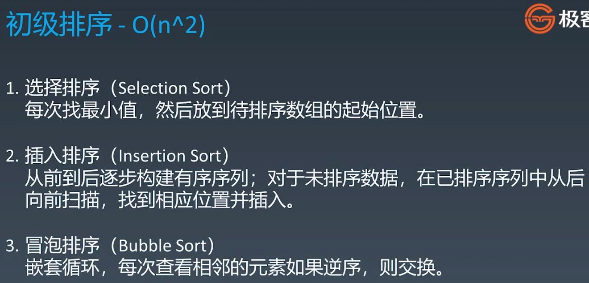
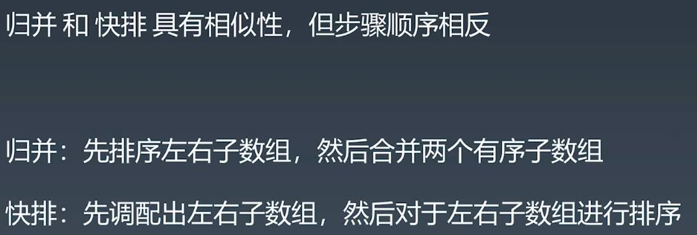
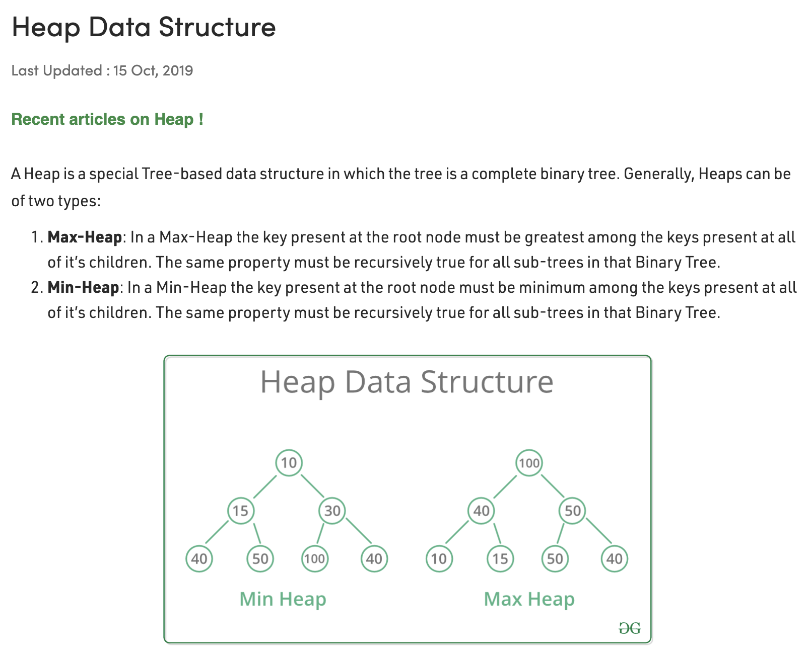
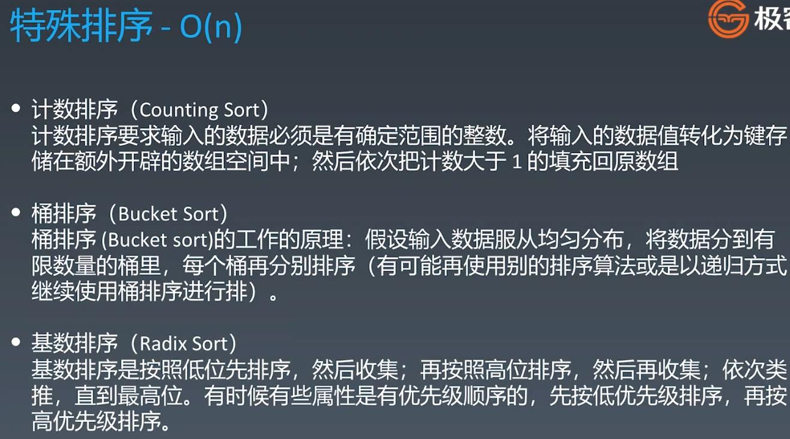

##Sorting Algorithm - Reading
####https://www.cnblogs.com/onepixel/p/7674659.html - 十大经典排序算法（动图演示）
####https://www.bilibili.com/video/av25136272       - 简单明了, 9种经典排序算法可视化动画
####https://www.bilibili.com/video/av63851336       - 6分钟看完15种排序算法动画展示
<br></br>
###Sorting Algorithm - Classfication


###Sorting Complexity (Very familiar with O(N logN) - Sorting: Quick Sorting, Merge Sorting, Heap Sorting)

<br></br>
## Elementary Sorting Algorithms - Time Complexity:O(n^2)

```
    // swap the smallest to the beggining by iterate (0 .. n)
    // selection sort & return swap count
    public int selectionSort(int[] nums) {
        int count = 0;
        for (int i = 0; i < nums.length; i++) {
            for (int j = i + 1; j < nums.length; j++) {
                if (nums[i] > nums[j]) {
                    swap(nums, i, j);
                    count++;
                }
            }
        }
        return count;
    }

    // swap the biggest to the end by iterate (0 .. n)
    // bubble sort & return swap count
    public int bubbleSort(int[] nums) {
        int count = 0;
        for (int i = 0; i < nums.length; i++) {
            // because we need to compare nums[j] with nums[j+1], so j < (nums.length -i) - 1
            for (int j = 0; j < nums.length - 1 - i; j++) {
                if (nums[j] > nums[j + 1]) {
                    count++;
                    swap(nums, j, j + 1);
                }
            }
        }
        return count;
    }
    
    // move the small number one step each to the start of array 
    public int insertionSort(int[] nums) {
        if (nums == null || nums.length <= 1) return 0;
        int count = 0;
        for (int i = 1; i < nums.length; i++) {
            int j = i;
            while (j - 1 >= 0 && nums[j] < nums[j - 1]) {
                swap(nums, j, j - 1);
                count++;
                --j;
            }
        }
        return count;
    }
    
    private void swap(int[] nums, int i, int j) {
        int tmp = nums[i];
        nums[i] = nums[j];
        nums[j] = tmp;
    }
```
<br></br>
## Advanced Sorting
###Quick Sort
###快速排序使用分治法来把一个串（list）分为两个子串（sub-lists）。具体算法描述如下：
####1. 从数列中挑出一个元素，称为 “基准”（pivot）；
####2. 重新排序数列，所有元素比基准值小的摆放在基准前面，所有元素比基准值大的摆在基准的后面（相同的数可以到任一边）。在这个分区退出之后，该基准就处于数列的中间位置。这个称为分区（partition）操作；
####3. 递归地（recursive）把小于基准值元素的子数列和大于基准值元素的子数列排序。

```
    /*
        Quick Sort
     */
    public void quickSort(int[] nums) {
        _quickSort(nums, 0, nums.length - 1);
    }

    // helper function for recurring
    private void _quickSort(int[] nums, int i, int j) {
        // terminator
        if (i >= j) return;
        int pivot = partition(nums, i, j);
        _quickSort(nums, i, pivot - 1);
        _quickSort(nums, pivot + 1, j);
    }

    private int partition(int[] nums, int left, int right) {
        // use nums[left] as pivot
        int index = left;
        // move all nums which is smaller than nums[left] to the left
        for (int i = left + 1; i <= right; i++) {
            if (nums[i] < nums[left]) {
                swap(nums, i, ++index);
            }
        }
        // all numbers in (left+1, index) would be smaller than left, swap left with index, and return index as the pivot
        swap(nums, left, index);
        return index;
    }

    private void swap(int[] nums, int i, int j) {
        int tmp = nums[i];
        nums[i] = nums[j];
        nums[j] = tmp;
    }
```
###Merge Sort
###归并排序是建立在归并操作上的一种有效的排序算法。该算法是采用分治法（Divide and Conquer）的一个非常典型的应用。
###将已有序的子序列合并，得到完全有序的序列；即先使每个子序列有序，再使子序列段间有序。若将两个有序表合并成一个有序表，称为2-路归并:
####1.把长度为n的输入序列分成两个长度为n/2的子序列；
####2.对这两个子序列分别采用归并排序；
####3.将两个排序好的子序列合并成一个最终的排序序列。

```
    /*
        Merge Sort
     */
    public void mergeSort(int[] nums) {
        _mergeSort(nums, 0, nums.length - 1);
    }

    private void _mergeSort(int[] nums, int start, int end) {
        // terminator
        if (start >= end) return;
        int mid = (start + end) >> 1;
        _mergeSort(nums, start, mid);
        _mergeSort(nums, mid + 1, end);
        merge(nums, start, mid, end);
    }

    private void merge(int[] nums, int start, int mid, int end) {
        // new temp array to store merged array
        int[] tmp = new int[end - start + 1];
        int k = 0, i = start, j = mid + 1;
        while (i <= mid && j <= end) {
            tmp[k++] = nums[i] < nums[j] ? nums[i++] : nums[j++];
        }
        while (i <= mid) tmp[k++] = nums[i++];
        while (j <= end) tmp[k++] = nums[j++];
        // now k is the length of tmp
        System.arraycopy(tmp, 0, nums, start, k);
    }
```
###Quick Sort vs Merge Sort

<br></br>
##Heap Sort - We can use priority queue instead of self-defined heap

```
    public void sort(int arr[]) {
        int n = arr.length;

        // Build heap (rearrange array)
        for (int i = n / 2 - 1; i >= 0; i--)
            heapify(arr, n, i);

        // One by one extract an element from heap
        for (int i = n - 1; i >= 0; i--) {
            // Move current root to end
            int temp = arr[0];
            arr[0] = arr[i];
            arr[i] = temp;

            // call max heapify on the reduced heap
            heapify(arr, i, 0);
        }
    }

    // To heapify a subtree rooted with node i which is
    // an index in arr[]. n is size of heap
    void heapify(int arr[], int length, int i) {
        int largest = i;  // Initialize largest as root
        int left = 2 * i + 1, right = 2 * i + 2;  

        // If left child is larger than root
        if (left < length && arr[left] > arr[largest])
            largest = left;

        // If right child is larger than largest so far
        if (right < length && arr[right] > arr[largest])
            largest = right;

        // If largest is not root
        if (largest != i) {
            int swap = arr[i];
            arr[i] = arr[largest];
            arr[largest] = swap;

            // Recursively heapify the affected sub-tree
            heapify(arr, length, largest);
        }
    }
```
<br></br>
##Special Sorting

<br></br>
###Leetcode:
####1122. Relative Sort Array - easy - https://leetcode.com/problems/relative-sort-array/
####242. Valid Anagram - easy - https://leetcode.com/problems/valid-anagram/
####1244. Design A Leaderboard - Medium - https://leetcode.com/problems/design-a-leaderboard/
####56. Merge Intervals - medium - https://leetcode.com/problems/merge-intervals/
####剑指 Offer 51. 数组中的逆序对 - hard - https://leetcode-cn.com/problems/shu-zu-zhong-de-ni-xu-dui-lcof/
####493. Reverse Pairs - hard - https://leetcode.com/problems/reverse-pairs/
<br></br>
###Did the code, but not included in the project
####4. Median of Two Sorted Arrays - hard - https://leetcode.com/problems/median-of-two-sorted-arrays
####167. Two Sum II - Input array is sorted - easy - https://leetcode.com/problems/two-sum-ii-input-array-is-sorted 
####347. Top K Frequent Elements - medium - https://leetcode.com/problems/top-k-frequent-elements
####973. K Closest Points to Origin - medium - https://leetcode.com/problems/k-closest-points-to-origin/