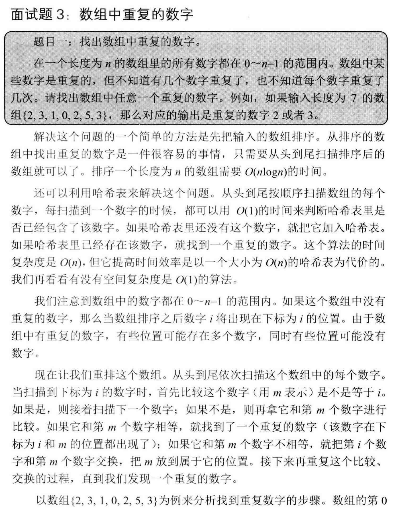
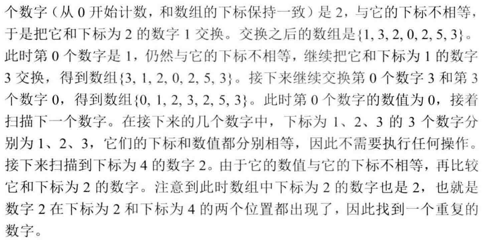
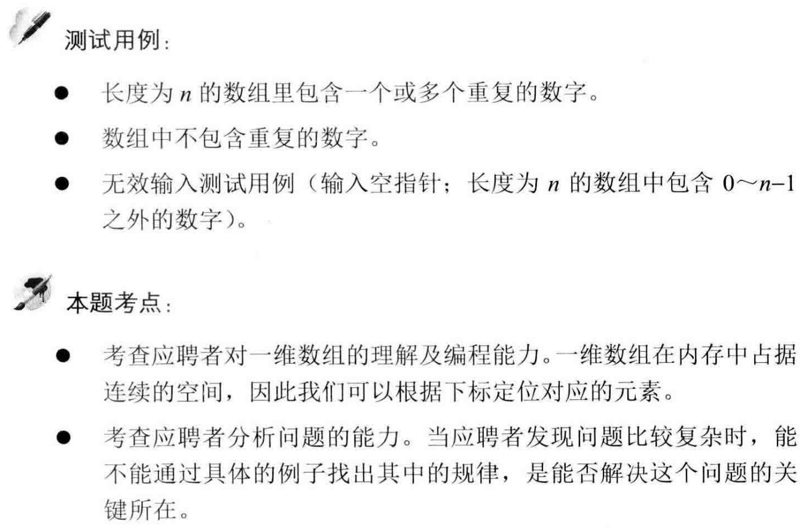
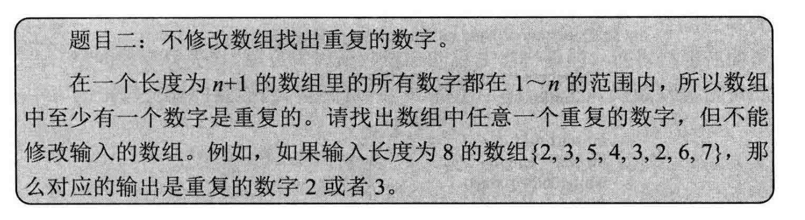
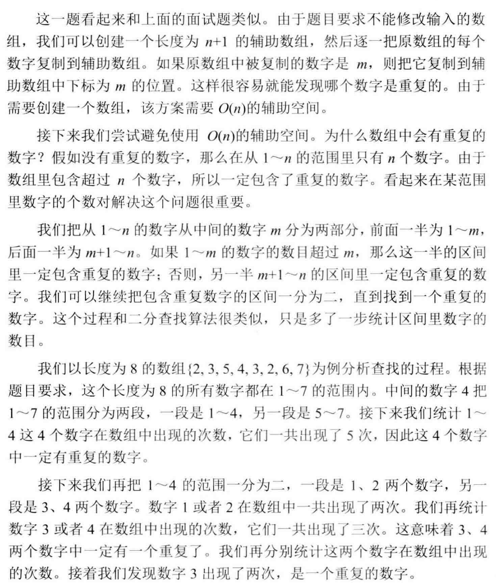
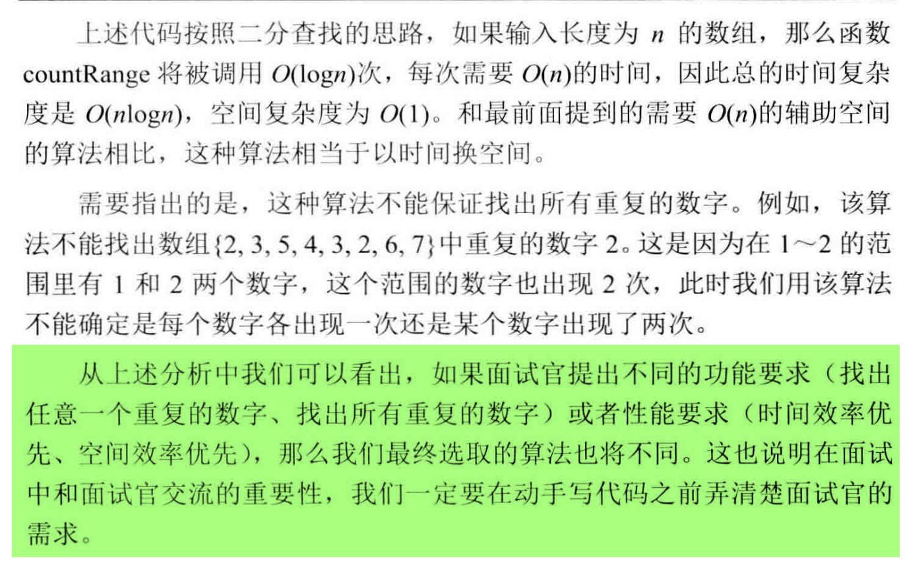
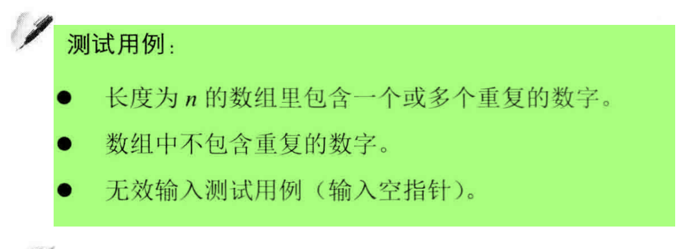

##剑指 Offer 03. 数组中重复的数字 - Easy
###https://blog.csdn.net/weixin_37672169/article/details/79978096


```
public class Solution {
    public static boolean duplicate(int[] arr) {
        // 入参检查
        if (arr == null || arr.length == 0) {
            return false;
        }
        for (int i = 0; i < arr.length; i++) {
            if (arr[i] < 0 || arr[i] >= arr.length) {
                return false;
            }
        }

        // 遍历数组
        for (int i = 0; i < arr.length; i++) {
            while (arr[i] != i) {
                if (arr[i] == arr[arr[i]]) {
                    System.out.println(arr[i]);
                    return true;
                }
                // 替换
                int temp = arr[i];
                arr[i] = arr[temp];
                arr[temp] = temp;
            }
        }
        return false;
    }

    public static void main(String[] args) {
        int[] arr = {1, 1, 2, 4, 2, 5, 6};
        boolean result = duplicate(arr);
        System.out.println(result);
    }
}
```

<br></br>
<br></br>


```
/*
    use secondary array: TC: O(N), SC: O(N)
*/
public class Solution {
    public static int getDuplication(int[] arr) {
        // 入参检查
        if (arr == null || arr.length == 0) {
            return -1;
        }
        for (int i = 0; i < arr.length; i++) {
            if (arr[i] < 1 || arr[i] >= arr.length) {
                return -1;
            }
        }

        int[] tempArr = new int[arr.length];
        for (int i = 0; i < arr.length; i++) {
            if (arr[i] == tempArr[arr[i]]) {
                return arr[i];
            }
            tempArr[arr[i]] = arr[i];
        }
        return -1;
    }

    public static void main(String[] args) {
        int[] numbers = {2, 1, 5, 4, 3, 2, 6, 7};
        System.out.println(getDuplication(numbers));
    }
}

/*
    Do not use secondary array: TC:O(N logN), SC: O(1)
*/
public class Solution {
    public static int getDuplication(int[] arr) {
        // 入参检查
        if (arr == null || arr.length == 0) {
            return -1;
        }
        for (int i = 0; i < arr.length; i++) {
            if (arr[i] < 1 || arr[i] >= arr.length) {
                return -1;
            }
        }

        int start = 1;
        int end = arr.length - 1;
        int mid = 0;
        int count = 0;
        while (start <= end) {
            if (start == end) {
                count = countRange(arr, start, end);
                if (count > 1) {
                    return start;
                } else {
                    break;
                }
            }
            mid = (start + end) / 2;
            count = countRange(arr, start, mid);
            if (count > mid - start + 1) {
                end = mid;
            } else {
                start = mid + 1;
            }
        }
        return -1;
    }

    public static int countRange(int[] arr, int start, int end) {
        int count = 0;
        for (int i = 0; i < arr.length; i++) {
            if (arr[i] >= start && arr[i] <= end) {
                count++;
            }
        }
        return count;
    }

    public static void main(String[] args) {
        int[] numbers = {1, 3, 5, 4, 2, 5, 6, 7};
        int result = Solution.getDuplication(numbers);
        System.out.println(result);
    }
}
```

