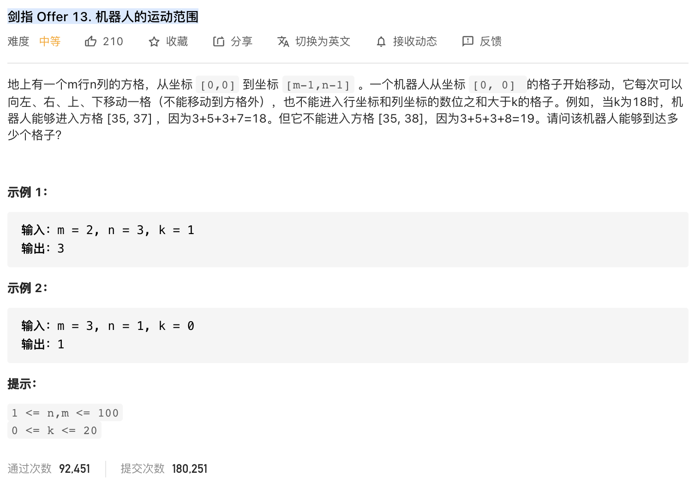
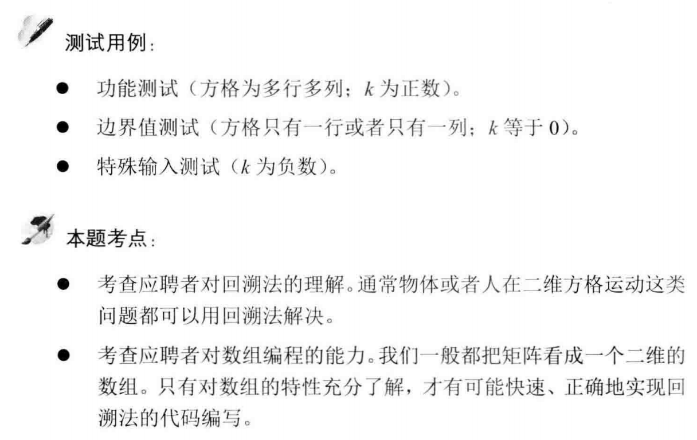

##剑指 Offer 13. 机器人的运动范围 - Medium - https://leetcode-cn.com/problems/ji-qi-ren-de-yun-dong-fan-wei-lcof/

###Solution 1 - DFS - TC: O(MN), SC: O(MN)
###https://leetcode-cn.com/problems/ji-qi-ren-de-yun-dong-fan-wei-lcof/solution/mian-shi-ti-13-ji-qi-ren-de-yun-dong-fan-wei-dfs-b/
```
    /*
        求得数位和Sx:
        由于机器人每次只能移动一格（即只能从 x 运动至 x±1），因此每次只需计算 x 到 x±1 的数位和增量。本题说明 1 <= n,m <= 100 ，以下公式仅在此范围适用
        数位和增量公式： 设 x 的数位和为 Sx:
        if (x+1) % 10 == 0 => Sx + 1 = Sx-8, 例如 19, 20 的数位和分别为 10, 2;
        if (x+1) % 10 != 0 => Sx + 1 = Sx+1, 例如 1,2 的数位和分别为 1,2
        
        so: (x + 1) % 10 != 0 ? Sx + 1 : Sx - 8;
     */

    class Solution {
        int m, n, k;
        boolean[][] visited;

        public int movingCount(int m, int n, int k) {
            this.m = m;
            this.n = n;
            this.k = k;
            this.visited = new boolean[m][n];
            return dfs(0, 0, 0, 0);
        }

        public int dfs(int i, int j, int si, int sj) {
            if (i >= m || j >= n || k < si + sj || visited[i][j]) return 0;
            visited[i][j] = true;
            return 1 + dfs(i + 1, j, (i + 1) % 10 != 0 ? si + 1 : si - 8, sj) + dfs(i, j + 1, si, (j + 1) % 10 != 0 ? sj + 1 : sj - 8);
        }
    }
```
###Solution 2 - BFS - TC: O(MN), SC: O(MN)
###https://leetcode-cn.com/problems/ji-qi-ren-de-yun-dong-fan-wei-lcof/solution/mian-shi-ti-13-ji-qi-ren-de-yun-dong-fan-wei-dfs-b/
```
    public int movingCount(int m, int n, int k) {
        boolean[][] visited = new boolean[m][n];
        int res = 0;
        Queue<int[]> queue = new LinkedList<int[]>();
        queue.add(new int[]{0, 0, 0, 0});
        while (queue.size() > 0) {
            int[] x = queue.poll();
            int i = x[0], j = x[1], si = x[2], sj = x[3];
            if (i >= m || j >= n || k < si + sj || visited[i][j]) continue;
            visited[i][j] = true;
            res++;
            queue.add(new int[]{i + 1, j, (i + 1) % 10 != 0 ? si + 1 : si - 8, sj});
            queue.add(new int[]{i, j + 1, si, (j + 1) % 10 != 0 ? sj + 1 : sj - 8});
        }
        return res;
    }
```
