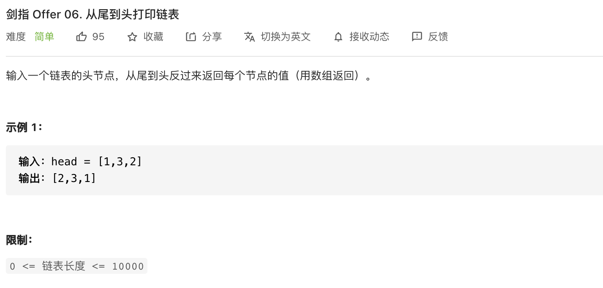
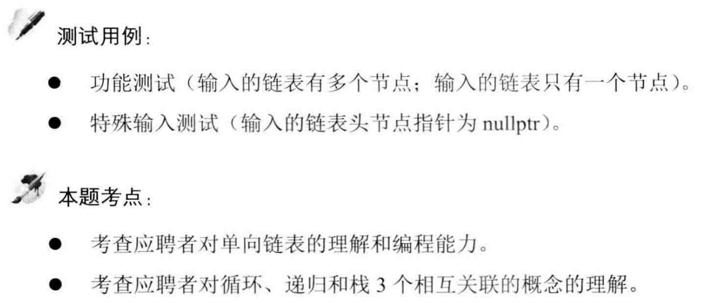

##剑指 Offer 06. 从尾到头打印链表 - Easy

###Solution - Use Stack of Recursion
```
public class PrintListReverse {
    // Use Stack
    public int[] reversePrint(ListNode head) {
        Stack<ListNode> stack = new Stack<>();
        while (head != null) {
            stack.add(head);
            head = head.next;
        }

        int[] arr = new int[stack.size()];
        int i = 0;
        while (!stack.isEmpty()) {
            arr[i++] = stack.pop().val;
        }
        return arr;
    }

    // Use Recursion
    public int[] reversePrint(ListNode head) {
        List<Integer> list = new ArrayList<>();
        recur(head, list);
        int[] arr = new int[list.size()];
        for (int i = 0; i < arr.length; i++) {
            arr[i] = list.get(i);
        }
        return arr;
    }

    public void recur(ListNode node, List<Integer> list) {
        if (node == null) return;
        recur(node.next, list);
        list.add(node.val);
    }
}

// 定义链表结构
class ListNode {
    int val;
    ListNode next;
    ListNode(int x) {
        val = x;
    }
}
```
