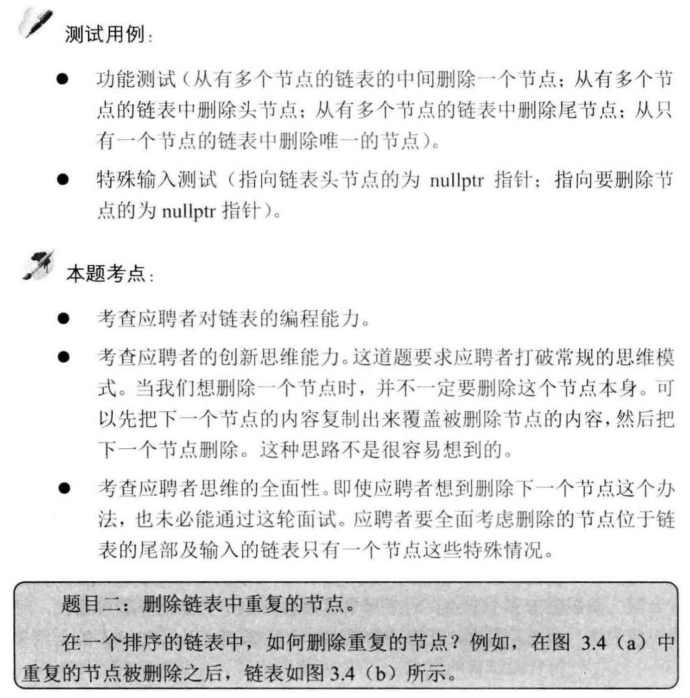

##剑指 Offer 18. 删除链表的节点 - Easy - https://leetcode-cn.com/problems/shan-chu-lian-biao-de-jie-dian-lcof/

###Solution - Two Pointers - TC: O(N), SC: O(1)
```
    public ListNode deleteNode(ListNode head, int val) {
        if (head == null) return null;
        if (head.val == val) return head.next;
        ListNode pre = head, cur = head.next;
        while (cur != null) {
            if (cur.val == val) pre.next = cur.next;
            pre = cur;
            cur = cur.next;
        }
        return head;
    }
```

###Solution - Two Pointers & HashSet - TC: O(N), SC: O(N)
```
    public ListNode removeDuplicate(ListNode head) {
        if (head == null) return null;
        Set<Integer> set = new HashSet<>();
        set.add(head.val);
        ListNode pre = head, cur = head.next;
        while (cur != null) {
            if (set.contains(cur.val)) {
                while (cur.next != null && cur.next.val == cur.val) cur = cur.next;
                pre.next = cur.next;
            }
            pre = cur;
            cur = cur.next;
            set.add(cur.val);
        }
        return head;
    }
```

