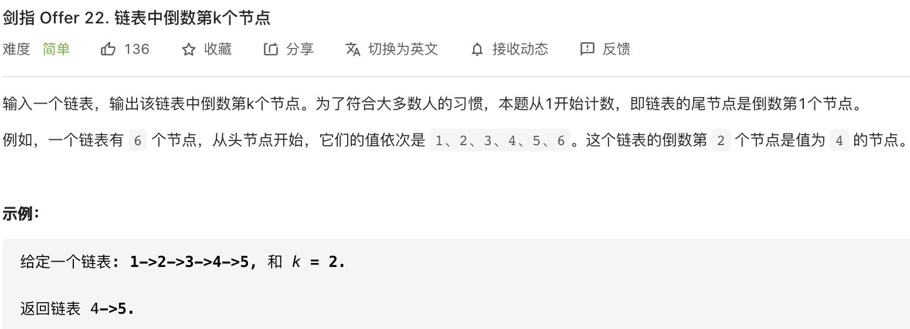
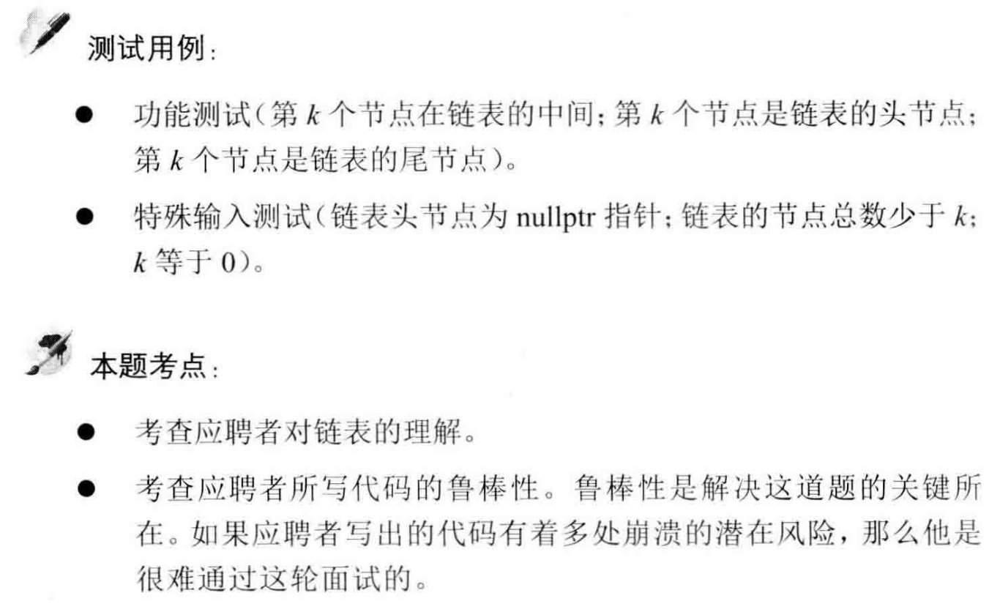

##剑指 Offer 22. 链表中倒数第k个节点 - Easy - https://leetcode-cn.com/problems/lian-biao-zhong-dao-shu-di-kge-jie-dian-lcof/

###Solution - Two Pointers - TC: O(N), SC: O(1) - K may be less than or equal to 0, or K may be greater than the Lengths
```
    public ListNode getKthFromEnd(ListNode head, int k) {
        if (k <= 0 || head == null) return null;
        ListNode left = head, right = head;
        for (int i = 1; i < k; i++) {
            if (right.next == null) return null;
            right = right.next;
        }
        while (right.next != null) {
            left = left.next;
            right = right.next;
        }
        return left;
    }

    static class ListNode {
        int val;
        ListNode next;

        ListNode(int x) {
            val = x;
        }
    }
```
