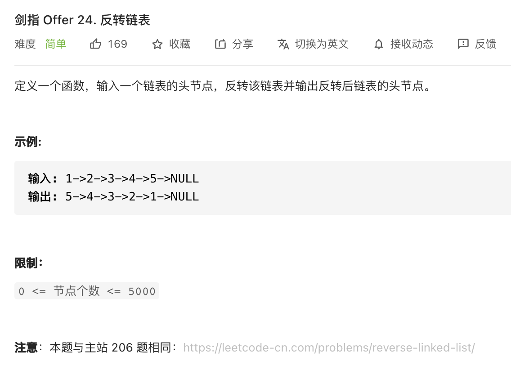

##剑指 Offer 24. 反转链表 - Easy - https://leetcode-cn.com/problems/fan-zhuan-lian-biao-lcof/
###same as: https://leetcode-cn.com/problems/reverse-linked-list/

###Solution 1 - Two Pointers - TC: O(N), SC: O(1)
```
    public ListNode reverseList(ListNode head) {
        ListNode cur = null, next = head;
        while(next != null){
            ListNode tmp = next.next;
            next.next = cur;
            cur = next;
            next = tmp;
        }
        return cur;
    }
```
###Solution 2 - Recursion - TC: O(N), SC: O(1)
```
    /*
        for Input: 1->2->3->4->5->NULL
        recursion will calculate from the last to the first
    */
    public ListNode reverseList(ListNode head) {
        if(head == null) return null;
        ListNode end = dfs(head);
        head.next = null;
        return end;
    }

    private ListNode dfs(ListNode node) {
        // terminator: return the last node
        if (node == null || node.next == null) return node;
        ListNode end = dfs(node.next);
        node.next.next = node;
        return end;
    }
```