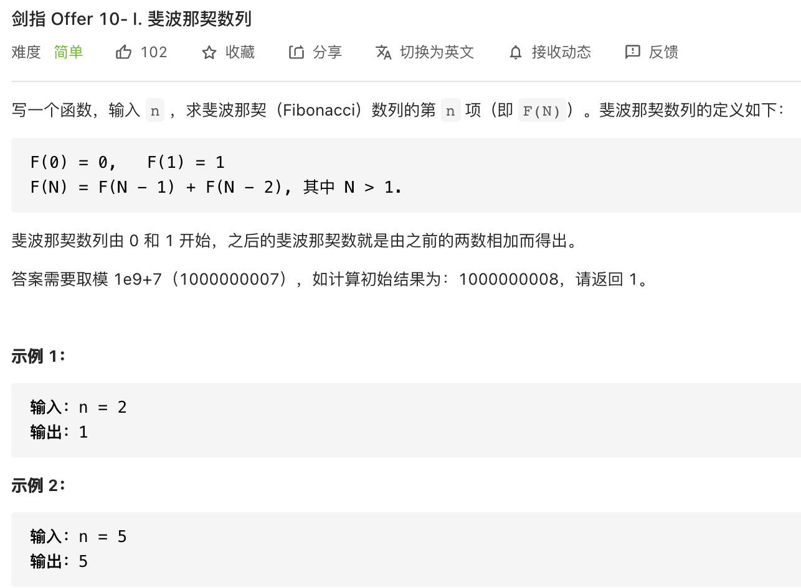

##剑指 Offer 10- I. 斐波那契数列 - Easy - https://leetcode-cn.com/problems/fei-bo-na-qi-shu-lie-lcof/

```
    // Iteration
    public int fib(int n) {
        if (n <= 1) return n;
        int pre = 0, cur = 1;
        for (int i = 1; i < n; i++) {
            int tmp = cur;
            cur = (pre + cur) % 1000000007;
            pre = tmp;
        }
        return cur;
    }
    
    // Recursion
    public int fib(int n) {
        return dfs(n, new int[n + 1]);
    }

    public int dfs(int n, int[] memo) {
        if (n <= 1) return n;
        if (memo[n] != 0) return memo[n];
        memo[n] = (dfs(n - 1, memo) + dfs(n - 2, memo)) % 1000000007;
        return memo[n];
    }
```