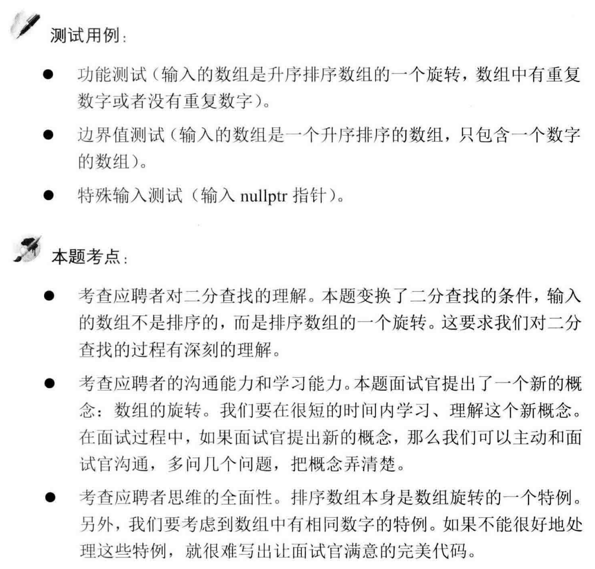

##剑指 Offer 11. 旋转数组的最小数字 - Easy - https://leetcode-cn.com/problems/xuan-zhuan-shu-zu-de-zui-xiao-shu-zi-lcof/

###Solution: Binary Search - TC: O(logN) SC: O(1)
###https://leetcode-cn.com/problems/xuan-zhuan-shu-zu-de-zui-xiao-shu-zi-lcof/solution/mian-shi-ti-11-xuan-zhuan-shu-zu-de-zui-xiao-shu-3/
```
     /*
        Special Case: [1, 3, 3], [3, 3, 1, 3]
     */
    public int minArray(int[] numbers) {
        if (numbers == null || numbers.length <= 0) return -1;
        int i = 0, j = numbers.length - 1;
        while (i < j) {
            int mid = (i + j) >> 1;
            if (numbers[mid] > numbers[j]) i = mid + 1; // cannot be equal here
            else if (numbers[mid] < numbers[j]) j = mid; // cannot be equal here
            else j--;
        }
        return numbers[i];
    }
```

