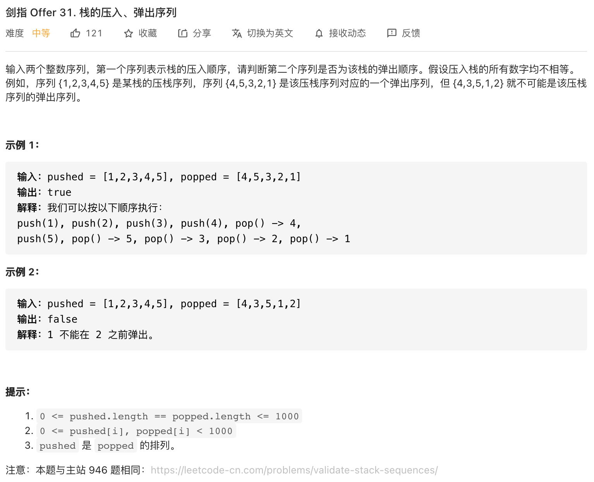

##剑指 Offer 31. 栈的压入、弹出序列 - Medium - https://leetcode-cn.com/problems/zhan-de-ya-ru-dan-chu-xu-lie-lcof/
###same as: https://leetcode-cn.com/problems/validate-stack-sequences/

###Solution - Subsidiary Stack - TC: O(N), SC: O(N)
###https://leetcode-cn.com/problems/zhan-de-ya-ru-dan-chu-xu-lie-lcof/solution/mian-shi-ti-31-zhan-de-ya-ru-dan-chu-xu-lie-mo-n-2/
```
    public boolean validateStackSequences(int[] pushed, int[] popped) {
        Stack<Integer> stack = new Stack<>();
        int i = 0;
        for (int num : pushed) {
            stack.push(num);
            while (!stack.isEmpty() && stack.peek() == popped[i]) {
                stack.pop();
                i++;
            }
        }
        return stack.isEmpty();
    }
```
###Solution - Using pushed as Stack - TC: O(N), SC: O(1)
###https://leetcode.com/problems/validate-stack-sequences/discuss/197685/C%2B%2BJavaPython-Simulation-O(1)-Space
```
    public boolean validateStackSequences(int[] pushed, int[] popped) {
        int i = 0, j = 0;
        for (int x : pushed) {
            pushed[i++] = x;
            while (i > 0 && pushed[i - 1] == popped[j]) {
                --i;
                ++j;
            }
        }
        return i == 0;
    }
```