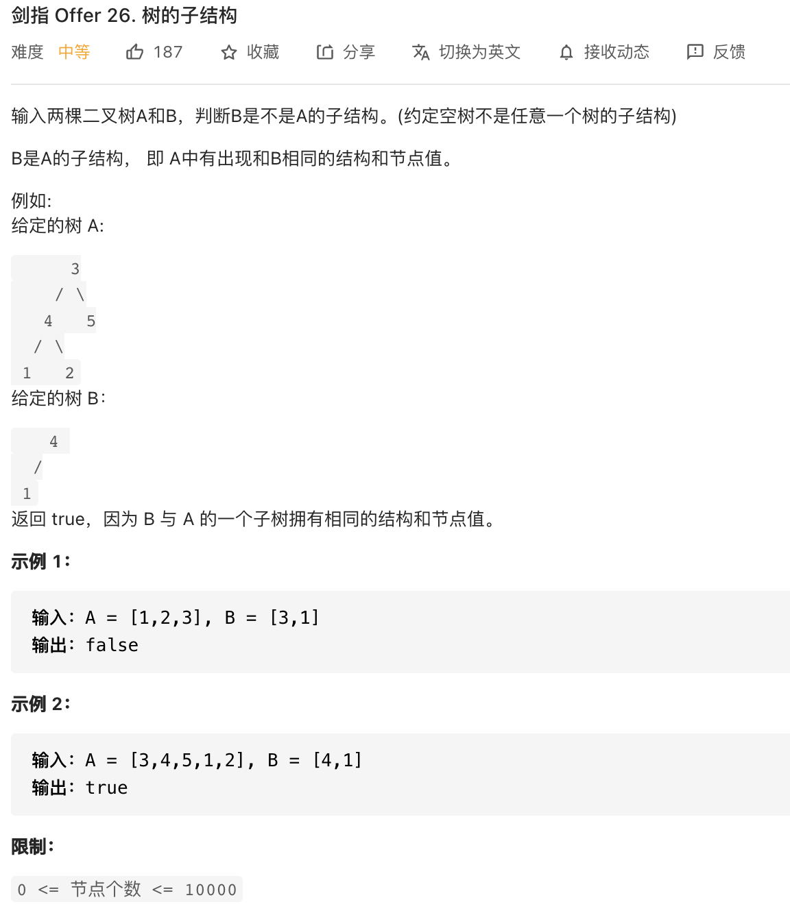

##剑指 Offer 26. 树的子结构 - Medium - https://leetcode-cn.com/problems/shu-de-zi-jie-gou-lcof/

###Solution - DFS - TC: O(N), SC: O(1)
```
    public boolean isSubStructure(TreeNode A, TreeNode B) {
        return (A != null && B != null) && (recur(A, B) || isSubStructure(A.left, B) || isSubStructure(A.right, B));
    }

    boolean recur(TreeNode A, TreeNode B) {
        if (B == null) return true;
        if (A == null || A.val != B.val) return false;
        return recur(A.left, B.left) && recur(A.right, B.right);
    }
    
    static class TreeNode {
        int val;
        TreeNode left;
        TreeNode right;

        TreeNode(int x) {
            val = x;
        }
    }
```
