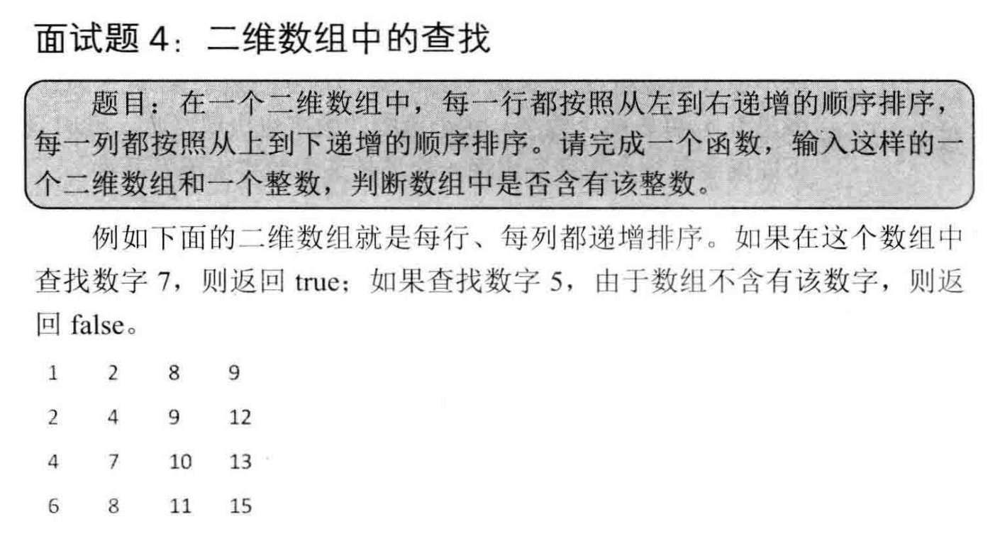
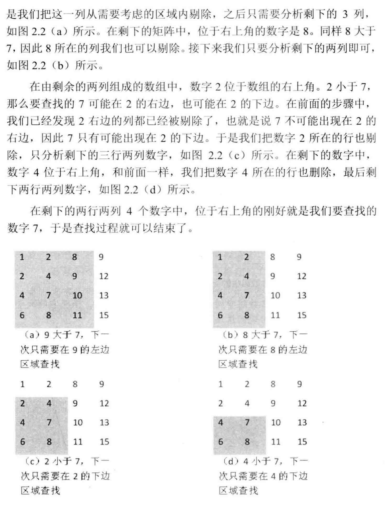
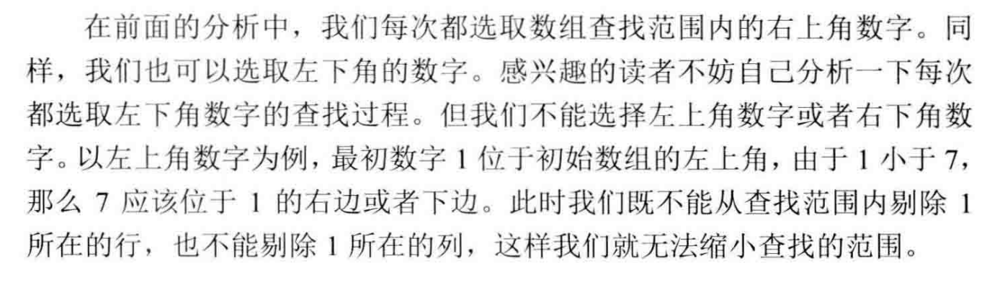
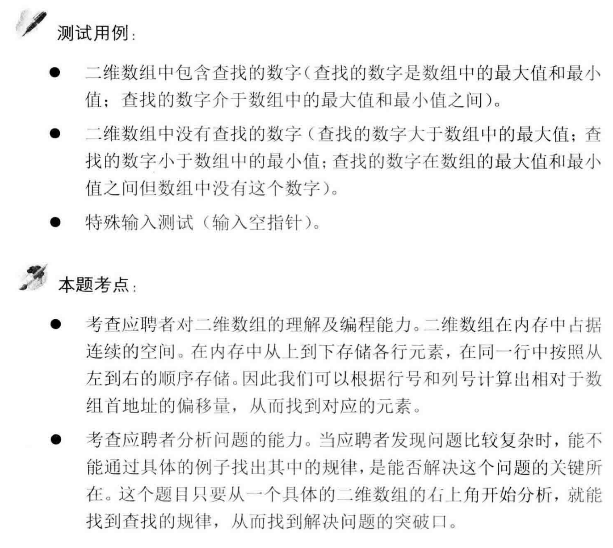

##剑指 Offer 04. 二维数组中的查找 - Medium
###https://blog.csdn.net/weixin_37672169/article/details/79979484



```
public class Solution {
    /*
    首先选取矩阵右上角的数字。如果等于要查找的数字，查找过程结束；
    如果大于要查找的数字，则剔除这个数字所在的列，
    如果小于要查找的数字，则剔除这个数字所在的行。
    这样每一步都可以缩减查找范围，直到找到要查找的数字，或者查找失败
     */
    public static boolean find(int arr[][], int number) {
        boolean flag = false;

        if (arr != null && arr.length != 0) {
            int rows = arr.length; // 行数
            int columns = arr[0].length; // 列数

            //当前的行和列
            int currRow = 0;
            int currCol = columns - 1;

            while (currRow <= rows - 1 && currCol >= 0) {
                // 比较二维数组中元素与number的关系
                if (arr[currRow][currCol] == number) {
                    flag = true;
                    break;
                } else if (arr[currRow][currCol] > number) {
                    currCol--;
                } else {
                    currRow++;
                }
            }
        }
        return flag;
    }

    public static void main(String args[]) {
        // 测试用例
        int array[][] = {{1, 2, 8, 9}, {2, 4, 9, 12}, {4, 7, 10, 13}, {6, 8, 11, 15}};
        boolean flag = find(array, 15);
        System.out.println(flag);
    }
}
```

