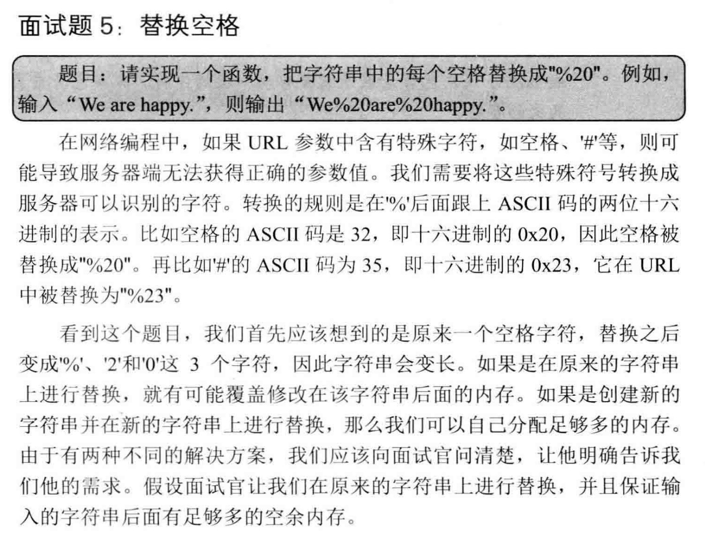
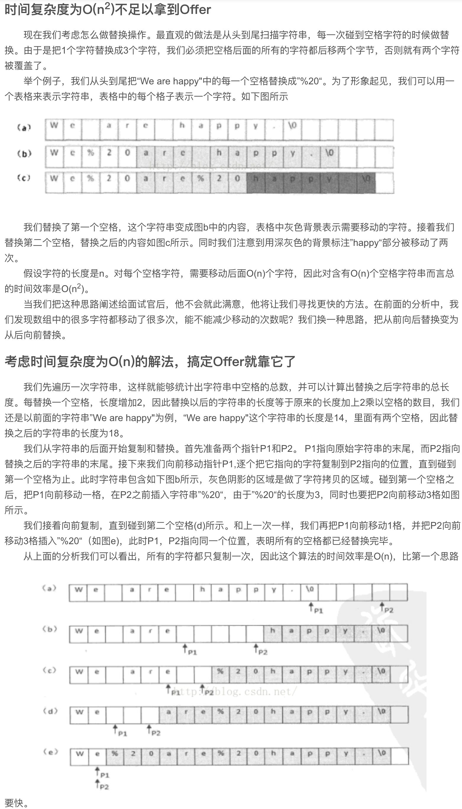
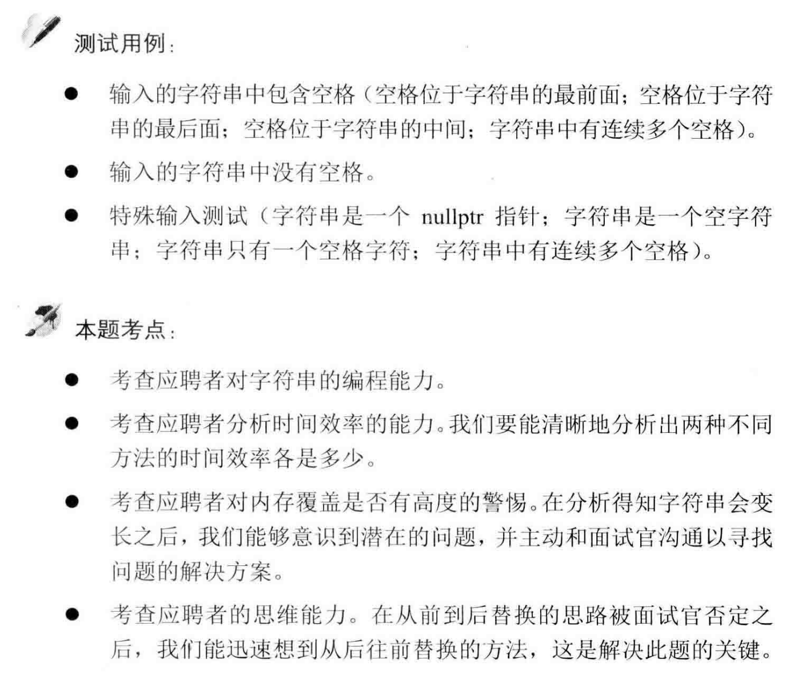

##剑指 Offer 05. 替换空格 - Easy
###https://blog.csdn.net/weixin_37672169/article/details/79979710


```
public class Solution {
    /*
        Use StringBuilder, TC: O(N), SC: O(N)
    */
    public static String replaceSpace(String inputStr) {
        // 参数检查
        if (inputStr == null || inputStr.length() == 0) {
            return null;
        }
        StringBuilder strBuilder = new StringBuilder();

        for (int i = 0; i < inputStr.length(); i++) {
            if (inputStr.charAt(i) == ' ') {
                strBuilder.append("%20");
            } else {
                strBuilder.append(inputStr.charAt(i));
            }
        }
        return strBuilder.toString();
    }
    
    /*
        alter current array: TC: O(2N) => O(N), SC: O(1)
    */
    public static String replaceSpace(char[] arr, int length) {
        // 查询空格的个数
        int count = 0;
        for (int i = 0; i < length; i++) {
            if (arr[i] == ' ') {
                count++;
            }
        }
        // 重新计算新数组的大小
        int newLength = length + count * 2;
        // 从尾到头查找
        int i = length - 1;
        int j = newLength - 1;
        while (i >= 0 && j >= i) {
            if (arr[i] == ' ') {
                arr[j--] = '0';
                arr[j--] = '2';
                arr[j--] = '%';
            } else {
                arr[j--] = arr[i];
            }
            i--;
        }
        return new String(arr, 0, newLength);
    }
}
```
