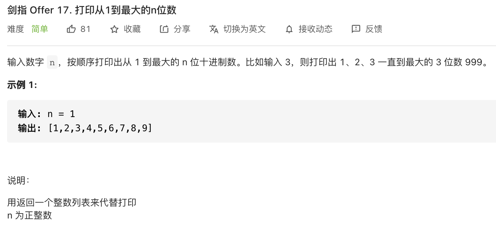

##剑指 Offer 17. 打印从1到最大的n位数 - Easy - https://leetcode-cn.com/problems/da-yin-cong-1dao-zui-da-de-nwei-shu-lcof/

###Solution - String
###https://leetcode-cn.com/problems/da-yin-cong-1dao-zui-da-de-nwei-shu-lcof/solution/mian-shi-ti-17-da-yin-cong-1-dao-zui-da-de-n-wei-2/
###实际上，本题的主要考点是大数越界情况下的打印
```
    /*
        题目要求打印 “从 1 至最大的 n 位数的列表” ，因此需考虑以下两个问题：
        1. 最大的 n 位数（记为 end ）和位数 n 的关系： 例如最大的 1 位数是 9 ，最大的 2 位数是 99 ，最大的 3 位数是 999 。则可推出：
            end = 10^n - 1
        2. 大数越界问题： 当 n 较大时，end 会超出 int32 整型的取值范围，超出取值范围的数字无法正常存储。因此用String来存贮数字
     */
    int[] res; //Math.pow返回的是double
    char[] nums, loop = {'0', '1', '2', '3', '4', '5', '6', '7', '8', '9'};
    int count = 0;//数组计数索引
    int x = 0; //x表示递归到第几层

    public int[] printNumbers(int n) {
        nums = new char[n];
        res = new int[(int) Math.pow(10, n) - 1]; //Math.pow返回的是double
        dfs(x, n);
        return res;
    }

    public void dfs(int depth, int n) {  //x表示递归到第几层
        if (depth == n) { //递归终止条件，x==n,此时要要结果数组res中添加数字
            String str = String.valueOf(nums);//把字符数组转换为字符串
            int temp = Integer.parseInt(str); //把字符串转换为整数,可以去掉前面的0, 因为返回的是int[], 所以数字应在Integer范围内
            if (temp != 0) {  //跳过0
                res[count++] = temp;//把字符串转换为整数后添加到结果数组中
                return;
            }
            return;
        }

        for (char ch : loop) { //对第x层的数字进行固定，然后继续向下一层递归
            nums[depth] = ch;
            dfs(depth + 1, n);
        }
    }
```