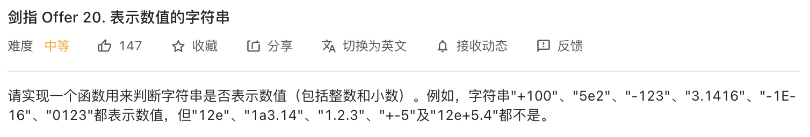

##剑指 Offer 20. 表示数值的字符串 - Medium - https://leetcode-cn.com/problems/biao-shi-shu-zhi-de-zi-fu-chuan-lcof/

###Solution 1 - String Operation - Scan '+', '-' -> Scan Integer -> Scan '.' -> Scan Integer -> Scan 'e', 'E' -> Scan Integer
### - TC: O(N), SC: O(N)
###https://blog.csdn.net/weixin_37672169/article/details/80164483
```
    int index;

    public boolean isNumber(String s) {
        if (s == null || s.trim().length() == 0) return false;
        char[] chars = s.trim().toCharArray();

        index = 0;
        boolean flag = scanInteger(chars);
        //判断小数部分
        if (index < chars.length && chars[index] == '.') {
            index++;
            flag = scanUnsignedInteger(chars) || flag;
        }
        //判断指数部分
        if (index < chars.length && (chars[index] == 'e' || chars[index] == 'E')) {
            index++;
            flag = scanInteger(chars) && flag;
        }
        return index >= chars.length && flag;
    }

    //扫描整数部分
    public boolean scanInteger(char[] str) {
        if (index < str.length && (str[index] == '+' || str[index] == '-')) {
            index++;
        }
        return scanUnsignedInteger(str);
    }

    //扫描无符号整数部分
    public boolean scanUnsignedInteger(char[] str) {
        int temp = index;
        while (index < str.length && str[index] >= '0' && str[index] <= '9') {
            index++;
        }
        return index > temp;
    }
```
###Solution 2 - Finite-State Machine(FSM) - TC: O(N), SC: O(1)
###https://leetcode-cn.com/problems/biao-shi-shu-zhi-de-zi-fu-chuan-lcof/solution/mian-shi-ti-20-biao-shi-shu-zhi-de-zi-fu-chuan-y-2/
```
    public boolean isNumber(String s) {
        Map[] states = {
                new HashMap<>() {{ put(' ', 0); put('s', 1); put('d', 2); put('.', 4); }}, // 0.
                new HashMap<>() {{ put('d', 2); put('.', 4); }},                           // 1.
                new HashMap<>() {{ put('d', 2); put('.', 3); put('e', 5); put(' ', 8); }}, // 2.
                new HashMap<>() {{ put('d', 3); put('e', 5); put(' ', 8); }},              // 3.
                new HashMap<>() {{ put('d', 3); }},                                        // 4.
                new HashMap<>() {{ put('s', 6); put('d', 7); }},                           // 5.
                new HashMap<>() {{ put('d', 7); }},                                        // 6.
                new HashMap<>() {{ put('d', 7); put(' ', 8); }},                           // 7.
                new HashMap<>() {{ put(' ', 8); }}                                         // 8.
        };
        int p = 0;
        char t;
        for (char c : s.toCharArray()) {
            if (c >= '0' && c <= '9') t = 'd';
            else if (c == '+' || c == '-') t = 's';
            else if (c == 'e' || c == 'E') t = 'e';
            else if (c == '.' || c == ' ') t = c;
            else t = '?';
            if (!states[p].containsKey(t)) return false;
            p = (int) states[p].get(t);
        }
        return p == 2 || p == 3 || p == 7 || p == 8;
    }
```

