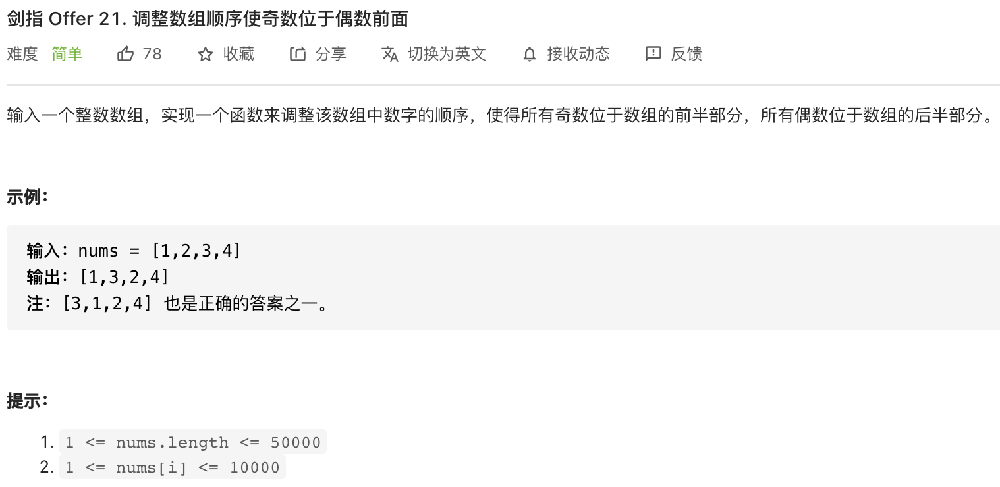
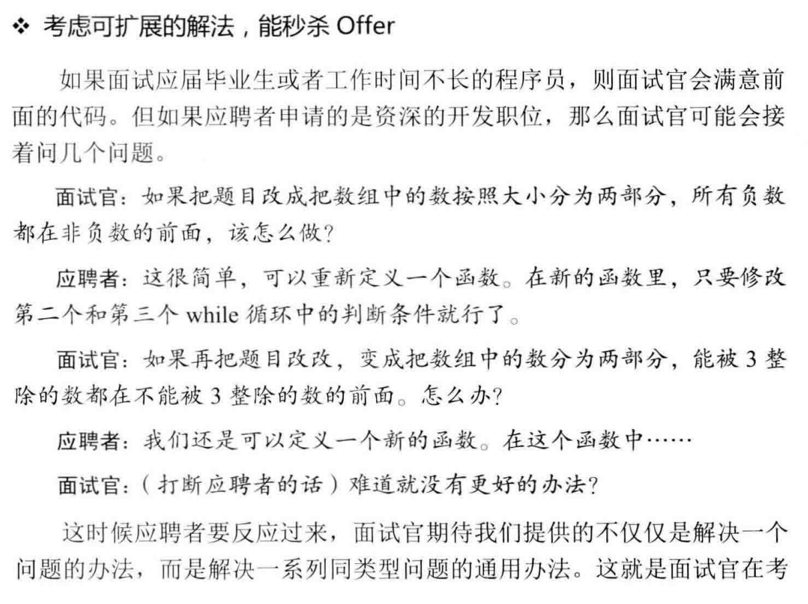

##剑指 Offer 21. 调整数组顺序使奇数位于偶数前面 - Easy - https://leetcode-cn.com/problems/diao-zheng-shu-zu-shun-xu-shi-qi-shu-wei-yu-ou-shu-qian-mian-lcof/

###Solution - Header_Tail Pointers - TC: O(N), SC: O(1)
###https://leetcode-cn.com/problems/diao-zheng-shu-zu-shun-xu-shi-qi-shu-wei-yu-ou-shu-qian-mian-lcof/solution/ti-jie-shou-wei-shuang-zhi-zhen-kuai-man-shuang-zh/
```
    public int[] exchange(int[] nums) {
        if (nums == null || nums.length == 1) return nums;
        int head = 0, tail = nums.length - 1;
        while (head < tail) {
            while (head < nums.length && (nums[head] & 1) == 1) head++;
            while (tail >= 0 && (nums[tail] & 1) == 0) tail--;
            if (head < tail) {
                int tmp = nums[head];
                nums[head] = nums[tail];
                nums[tail] = tmp;
            }
        }
        return nums;
    }
```

