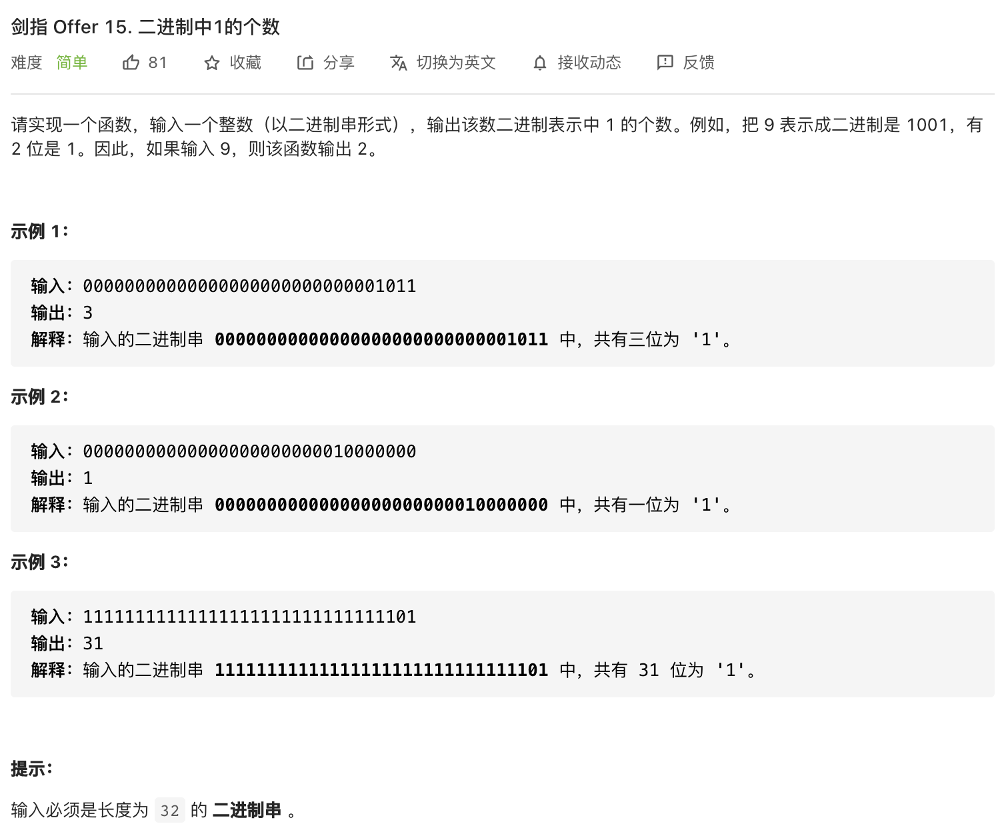
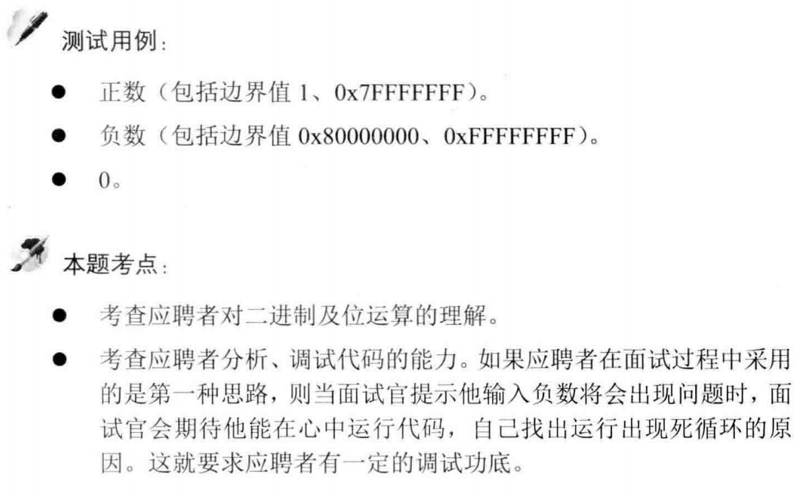

##剑指 Offer 15. 二进制中1的个数 - Easy - https://leetcode-cn.com/problems/er-jin-zhi-zhong-1de-ge-shu-lcof/

##Solution - Bit Operation - TC:O(M), SC:O(1) 
```
    public int hammingWeight(int n) {
        int count = 0;
        while (n != 0) { // not n > 0
            count++;
            n &= (n - 1);
        }
        return count;
    }
```
