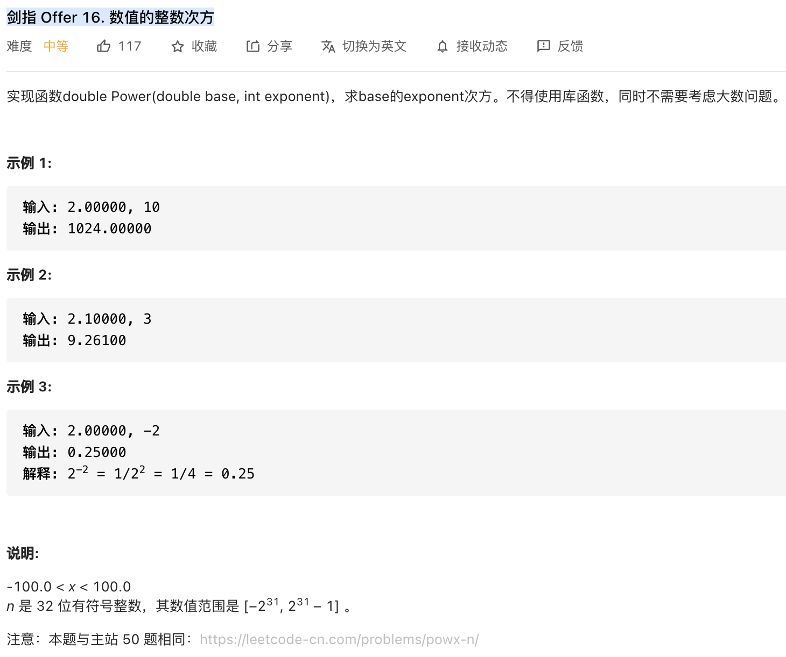

##剑指 Offer 16. 数值的整数次方 - Medium - https://leetcode-cn.com/problems/shu-zhi-de-zheng-shu-ci-fang-lcof/
##same as: https://leetcode-cn.com/problems/powx-n/

###Solution - Bit Operation & Dichotomy - TC: O(logN), SC: O(1)
```
    public double myPow(double x, int n) {
        if (x == 0) return 0;
        /*
            Java 代码中 int32 变量 n ∈ [−2147483648,2147483647] ，
            因此当 n = -2147483648 时执行 n = -n 会因越界而赋值出错。解决方法是先将 n 存入 long 变量 b ，后面用 b 操作即可。
         */
        long b = n;
        if (b < 0) {
            x = 1 / x;
            b = -b;
        }
        double res = 1.0;
        while (b > 0) {
            if ((b & 1) == 1) res *= x;
            x *= x;
            b >>= 1;
        }
        return res;
    }
```
