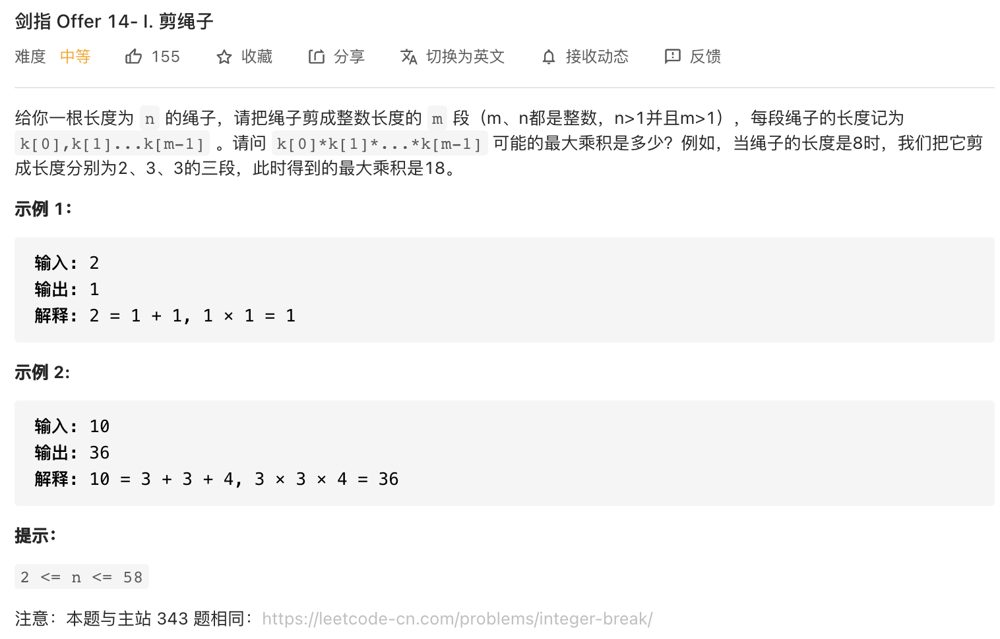
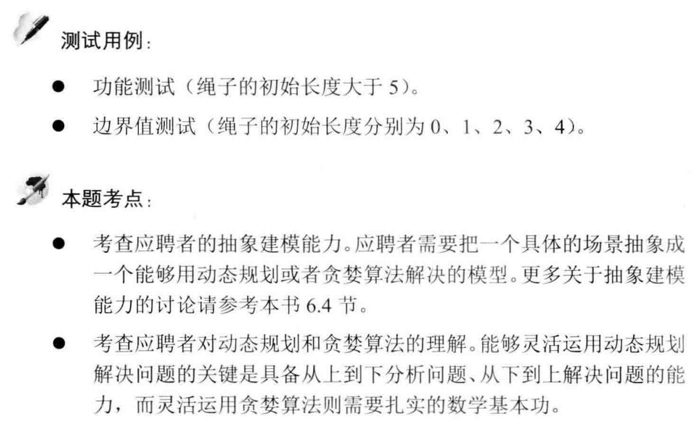

##剑指 Offer 14- I. 剪绳子 - Medium - https://leetcode-cn.com/problems/jian-sheng-zi-lcof/
##Same on：https://leetcode-cn.com/problems/integer-break/

###Solution - DP - TC: O(1), SC: O(1)
###https://leetcode-cn.com/problems/jian-sheng-zi-lcof/solution/mian-shi-ti-14-i-jian-sheng-zi-tan-xin-si-xiang-by/
```
    /*
        推论一： 将绳子 以相等的长度等分为多段 ，得到的乘积最大.
        推论二： 尽可能将绳子以长度 33 等分为多段时，乘积最大.
     */
    public int cuttingRope(int n) {
        if (n <= 3) return n - 1;
        int a = n / 3, b = n % 3;
        if (b == 0) return (int) Math.pow(3, a);
        if (b == 1) return (int) Math.pow(3, a - 1) * 4;
        return (int) Math.pow(3, a) * 2;
    }
```
