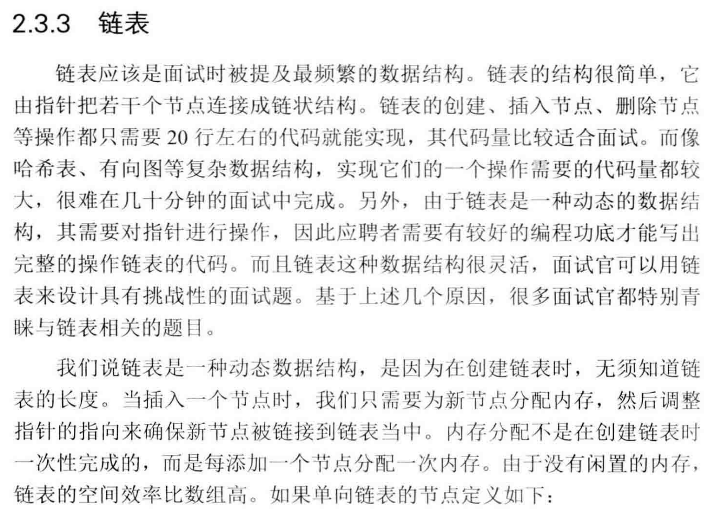
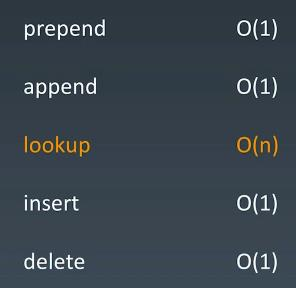

```
Source Code: LinkedList.java

public class LinkedList<E>
    extends AbstractSequentialList<E>
    implements List<E>, Deque<E>, Cloneable, java.io.Serializable
{
    transient int size = 0;

    /**
     * Pointer to first node.
     */
    transient Node<E> first;

    /**
     * Pointer to last node.
     */
    transient Node<E> last;

... more

    private static class Node<E> {
        E item;
        Node<E> next;
        Node<E> prev;

        Node(Node<E> prev, E element, Node<E> next) {
            this.item = element;
            this.next = next;
            this.prev = prev;
        }
    }

... more
}
```
##Linked List - Complexity
