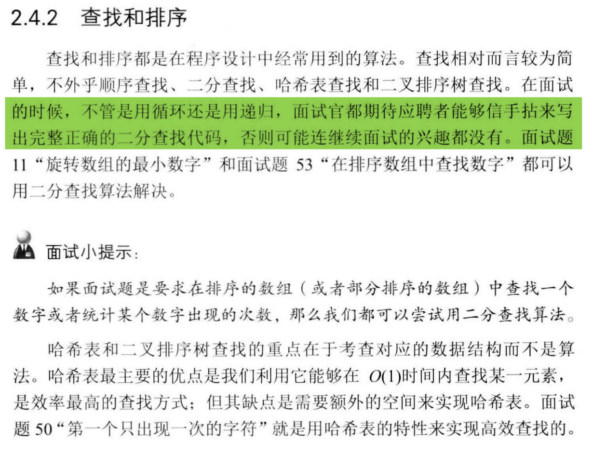
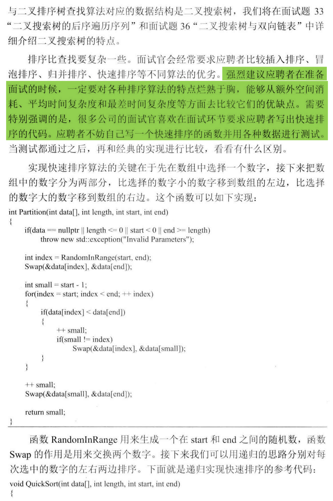
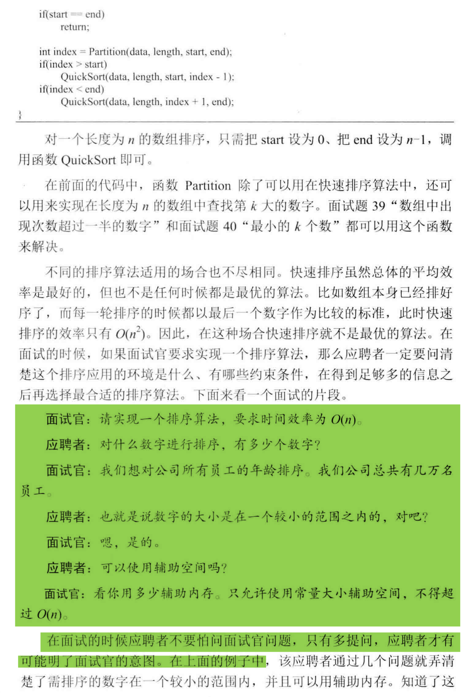
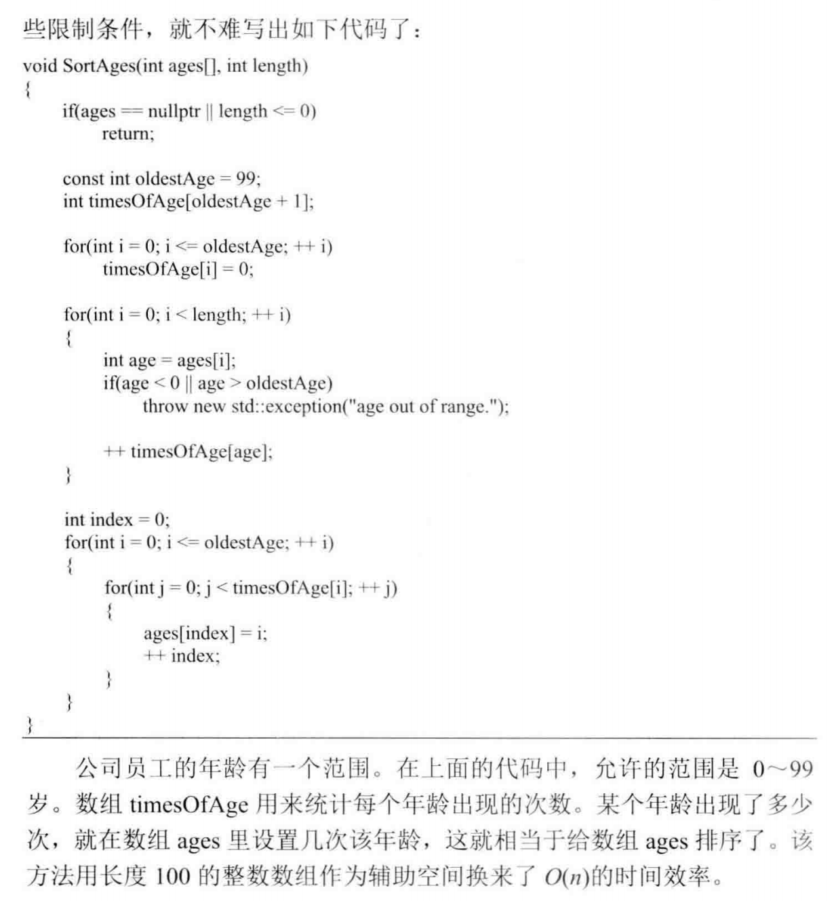

```
    // quick sort - Java - pick the end pos as the pivot every time
    public void quickSort(int[] arr, int begin, int end) {
        if (begin < end) {
            int partitionIndex = partition(arr, begin, end);
            quickSort(arr, begin, partitionIndex - 1);
            quickSort(arr, partitionIndex + 1, end);
        }
    }

    private int partition(int[] arr, int begin, int end) {
        int pivot = arr[end];
        int i = begin;
        for (int j = begin; j < end; j++) {
            if (arr[j] < pivot) {
                int tmp = arr[i];
                arr[i++] = arr[j];
                arr[j] = tmp;
            }
        }
        int tmp = arr[i];
        arr[i] = arr[end];
        arr[end] = tmp;
        return i;
    }
```