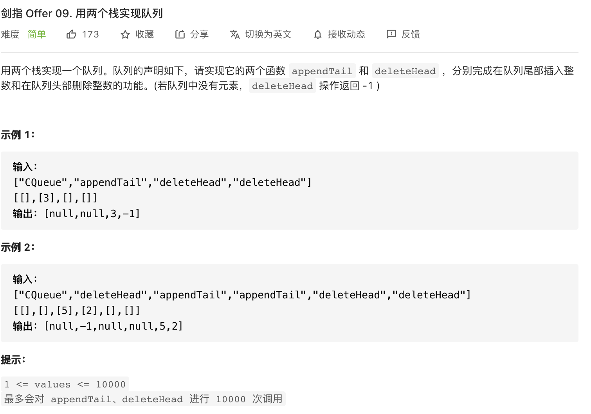
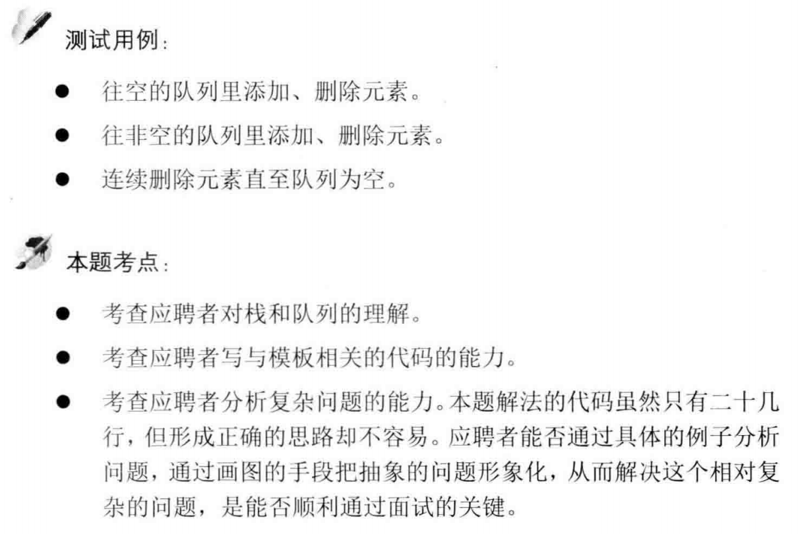

##剑指 Offer 09. 用两个栈实现队列 - Easy - https://leetcode-cn.com/problems/yong-liang-ge-zhan-shi-xian-dui-lie-lcof/

###TC: appendTail() - O(1), deleteHead() - O(N)
###https://leetcode-cn.com/problems/yong-liang-ge-zhan-shi-xian-dui-lie-lcof/solution/mian-shi-ti-09-yong-liang-ge-zhan-shi-xian-dui-l-2/
```
class CQueue {
    LinkedList<Integer> A, B;
    public CQueue() {
        A = new LinkedList<Integer>();
        B = new LinkedList<Integer>();
    }
    public void appendTail(int value) {
        A.addLast(value);
    }
    public int deleteHead() {
        if(!B.isEmpty()) return B.removeLast();
        if(A.isEmpty()) return -1;
        while(!A.isEmpty())
            B.addLast(A.removeLast());
        return B.removeLast();
    }
}
```
