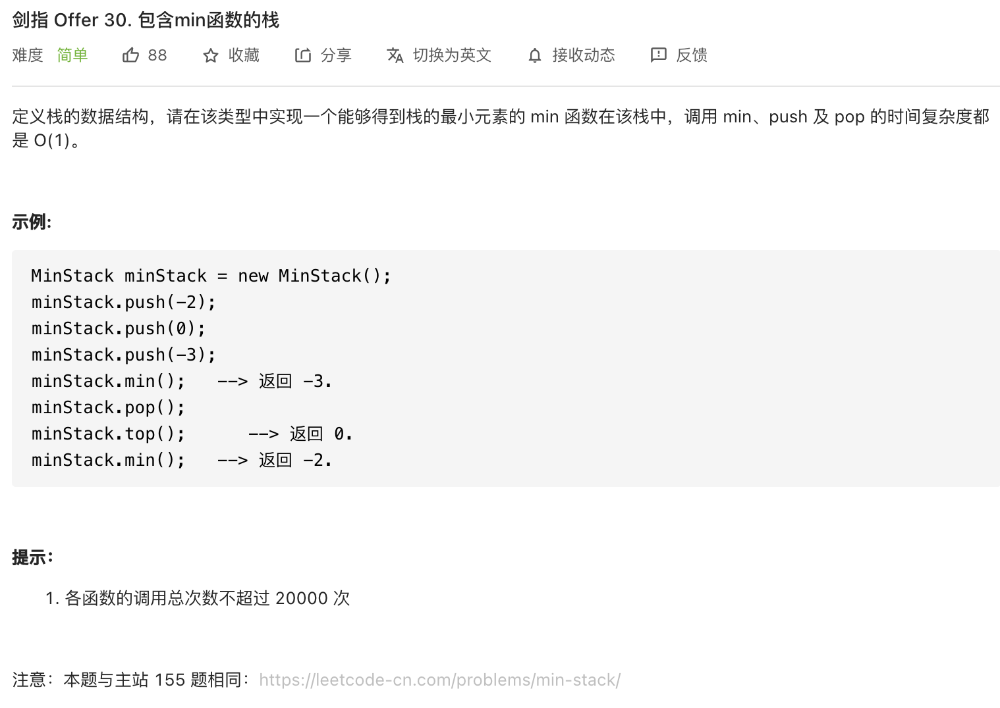

##剑指 Offer 30. 包含min函数的栈 - Easy - https://leetcode-cn.com/problems/bao-han-minhan-shu-de-zhan-lcof/
###same as: https://leetcode-cn.com/problems/min-stack/

##Solution 1 - Two Stacks - TC: O(1), SC: O(N)
```
class MinStack {
    private Stack<Integer> stack;
    private Stack<Integer> minStack;

    public MinStack() {
        stack = new Stack<>();
        minStack = new Stack<>();
    }

    public void push(int x) {
        stack.push(x);
        //be careful of the >=, it is necessary to include =
        if (minStack.isEmpty() || minStack.peek() >= x) {
            minStack.push(x);
        }
    }

    public void pop() {
        if (minStack.peek().equals(stack.pop())) {
            minStack.pop();
        }
    }

    public int top() {
        return stack.peek();
    }

    public int min() {
        return minStack.peek();
    }
}
```
##Solution 2 - One Stack - TC: O(1), SC: O(1)
##https://leetcode-cn.com/problems/min-stack/solution/xiang-xi-tong-su-de-si-lu-fen-xi-duo-jie-fa-by-38/
```
class MinStack {
    int min = Integer.MAX_VALUE;
    Stack<Integer> stack = new Stack<Integer>();
    public void push(int x) {
        //push the extra min to the stack, and assign x to min
        if(x <= min){
            stack.push(min);
            min=x;
        }
        stack.push(x);
    }

    public void pop() {
        //when pop() == min, the next one is the extra min pushed, pop it out and assign to min 
        if(stack.pop() == min) min=stack.pop();
    }

    public int top() {
        return stack.peek();
    }

    public int min() {
        return min;
    }
}
```