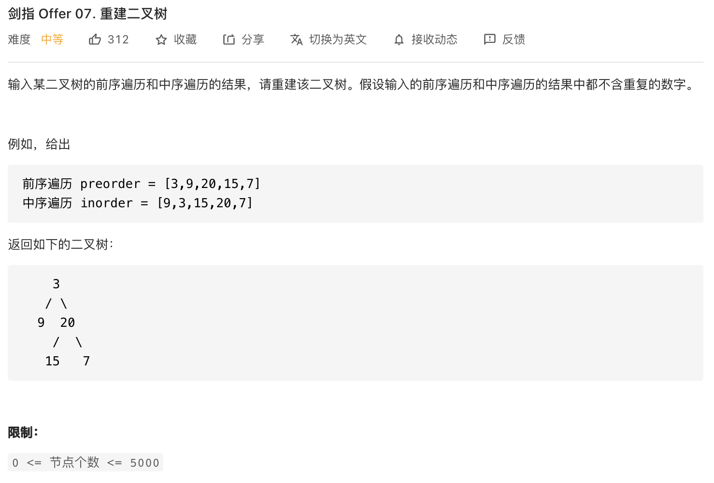
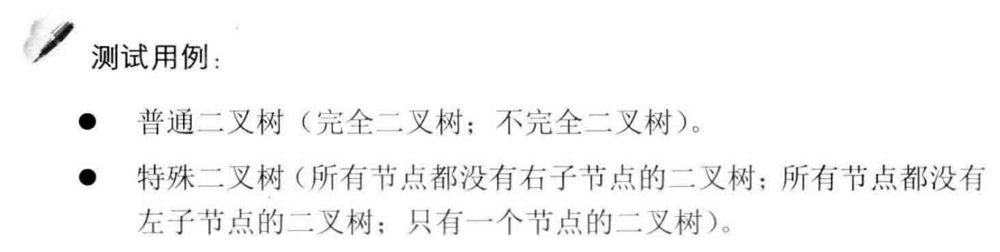
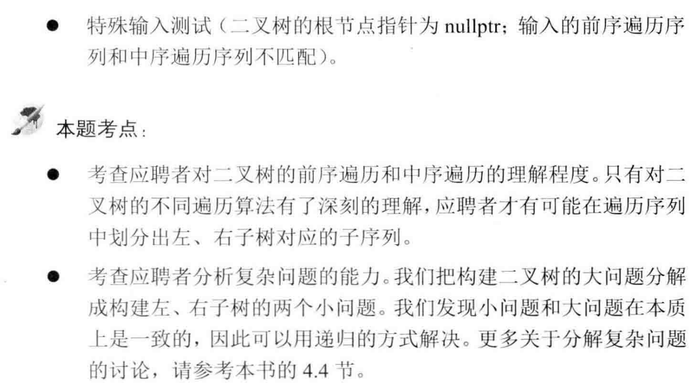

##剑指 Offer 07. 重建二叉树 - Medium - https://leetcode-cn.com/problems/zhong-jian-er-cha-shu-lcof/

###Solution - Recursion - TC: O(N), SC: O(N)
###https://leetcode-cn.com/problems/zhong-jian-er-cha-shu-lcof/solution/mian-shi-ti-07-zhong-jian-er-cha-shu-di-gui-fa-qin/
```
    int[] preorder;
    HashMap<Integer, Integer> dic = new HashMap<>(); //标记中序数组

    public TreeNode buildTree(int[] preorder, int[] inorder) {
        this.preorder = preorder;
        for (int i = 0; i < inorder.length; i++)
            dic.put(inorder[i], i);
        return recur(0, 0, inorder.length - 1);
    }

    private TreeNode recur(int root, int inOrderLeft, int inOrderRight) {
        if (inOrderLeft > inOrderRight) return null; // 递归终止
        TreeNode node = new TreeNode(preorder[root]); // 建立根节点
        int i = dic.get(preorder[root]); // 找到根结点在中序遍历中的位置，划分根节点、左子树、右子树
        node.left = recur(root + 1, inOrderLeft, i - 1); // 开启左子树递归
        int rightRoot = root + i - inOrderLeft + 1; // preorder中右子树的index
        node.right = recur(rightRoot, i + 1, inOrderRight); // 开启右子树递归
        return node;  
    }
```

