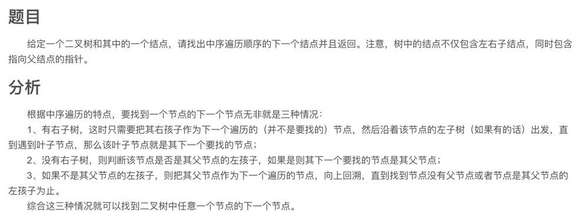
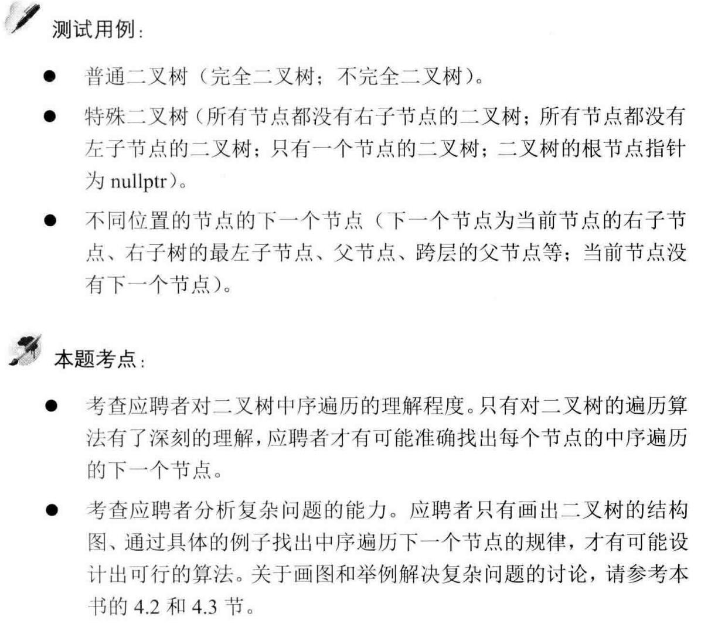

##剑指 Offer 08.二叉树的下一个节点 - https://blog.csdn.net/weixin_37672169/article/details/79981499

```
    public BinaryTreeNode getNextNode(BinaryTreeNode node) {
        // 入参检查
        if (node == null) return null;
        
        // 临时节点
        BinaryTreeNode tempNode = null;

        // 如果该节点有右子节点
        if (node.getRight() != null) {
            tempNode = node.getRight();
            while (tempNode.getLeft() != null) {
                tempNode = tempNode.getLeft();
            }
            return tempNode;
        }

        // 如果该节点没有右子节点，它是其父节点的左子节点
        if (node.getFather() == null) {
            return null;
        }
        if (node.getFather().getLeft() == node) {
            return node.getFather();
        }

        // 如果该节点没有右子节点，它是其父节点的右子节点
        tempNode = node.getFather();
        while (tempNode.getFather() != null) {
            if (tempNode.getFather().getLeft() == tempNode) {
                return tempNode.getFather();
            }
            //继续向上找父节点
            tempNode = tempNode.getFather();
        }
        return null;
    }

    static class BinaryTreeNode {

        private int value;
        private BinaryTreeNode left;
        private BinaryTreeNode right;
        private BinaryTreeNode father;

        public int getValue() {
            return value;
        }

        public void setValue(int value) {
            this.value = value;
        }

        public BinaryTreeNode getLeft() {
            return left;
        }

        public void setLeft(BinaryTreeNode left) {
            this.left = left;
        }

        public BinaryTreeNode getRight() {
            return right;
        }

        public void setRight(BinaryTreeNode right) {
            this.right = right;
        }

        public BinaryTreeNode getFather() {
            return father;
        }

        public void setFather(BinaryTreeNode father) {
            this.father = father;
        }
    }
```
