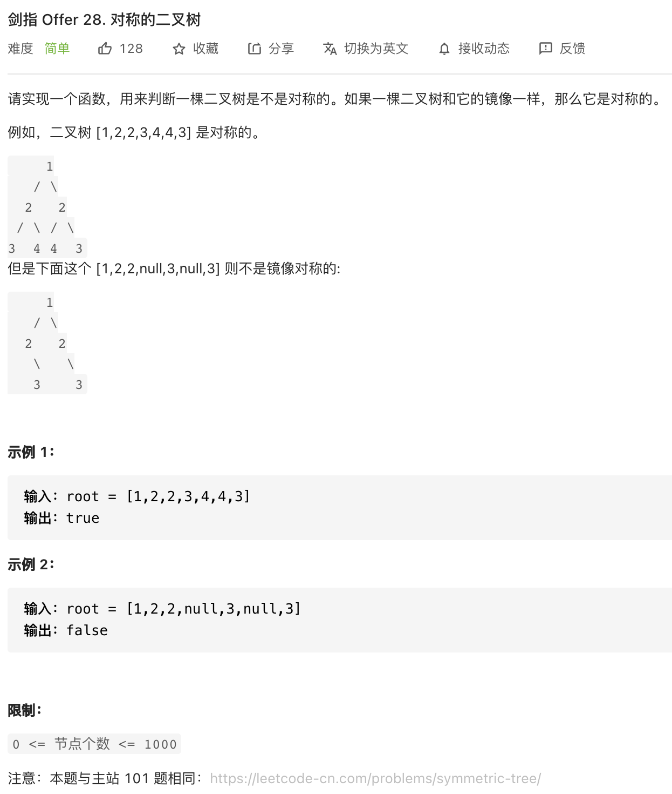
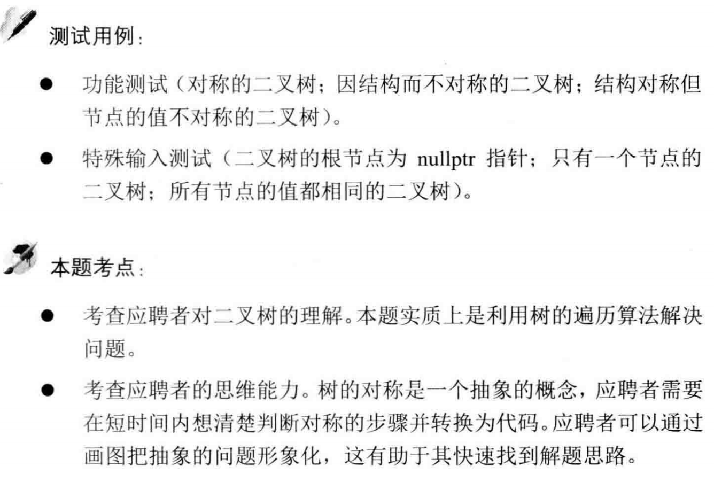

##剑指 Offer 28. 对称的二叉树 - Easy - https://leetcode-cn.com/problems/dui-cheng-de-er-cha-shu-lcof/
###same as: https://leetcode-cn.com/problems/symmetric-tree/

###Solution - DFS - TC: O(N), SC: O(1)
```
    public boolean isSymmetric(TreeNode root) {
        return root == null || dfs(root.left, root.right);
    }

    private boolean dfs(TreeNode left, TreeNode right) {
        if (left == null && right == null) return true;
        if (left == null || right == null || left.val != right.val) return false;
        return dfs(left.left, right.right) && dfs(left.right, right.left);
    }
```
###Solution - BFS - TC: O(N), SC: O(N)
```
    public boolean isSymmetric(TreeNode root) {
        if (root == null) return true;
        Queue<TreeNode> queue = new LinkedList<>();
        queue.add(root.left);
        queue.add(root.right);
        while (!queue.isEmpty()) {
            TreeNode left = queue.poll();
            TreeNode right = queue.poll();
            if (left == null && right == null) continue;
            if (left == null || right == null || left.val != right.val) return false;
            queue.add(left.left);
            queue.add(right.right);
            queue.add(left.right);
            queue.add(right.left);
        }
        return true;
    }
```
