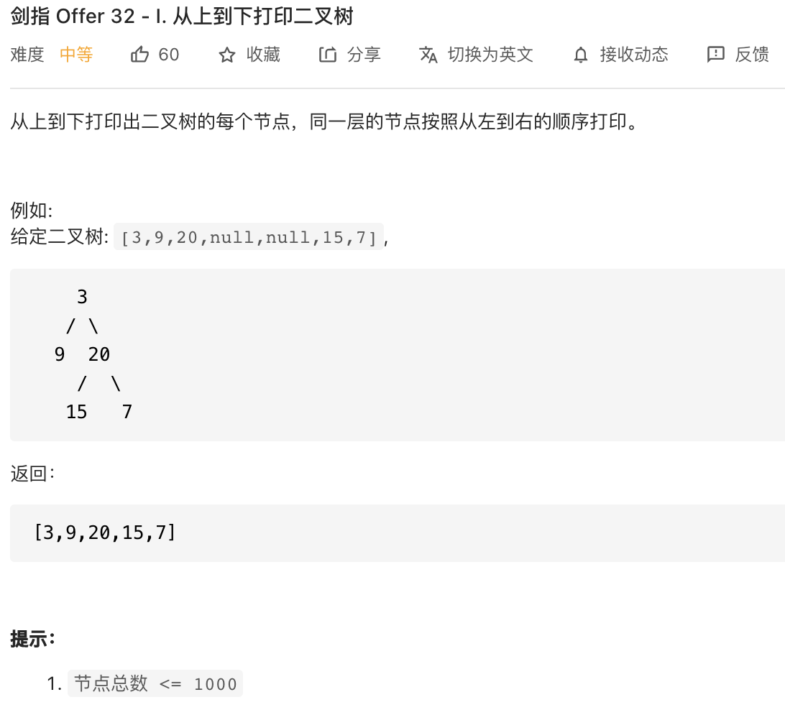

##剑指 Offer 32 - I. 从上到下打印二叉树 - Medium - https://leetcode-cn.com/problems/cong-shang-dao-xia-da-yin-er-cha-shu-lcof/

###Solution - BFS - TC: O(N), SC: O(N)
```
    // 1ms
    public int[] levelOrder(TreeNode root) {
        if (root == null) return new int[0];
        Queue<TreeNode> queue = new LinkedList<>();
        List<Integer> list = new ArrayList<>();
        queue.add(root);
        while (!queue.isEmpty()) {
            TreeNode node = queue.poll();
            list.add(node.val);
            if (node.left != null) queue.add(node.left);
            if (node.right != null) queue.add(node.right);
        }
        int[] res = new int[list.size()]; // faster than return res.stream().mapToInt(t -> t).toArray(); - 5ms
        for (int i = 0; i < list.size(); i++) {
            res[i] = list.get(i);
        }
        return res;
    }
```

###Solution - DFS - TC: O(N), SC: O(2N) - O(N)
```
    // 1ms
    public int[] levelOrder(TreeNode root) {
        if (root == null) return new int[0];
        List<List<Integer>> list = new ArrayList<>();
        levelHelper(list, root, 0);
        List<Integer> tempList = new ArrayList<>();
        for (List<Integer> integers : list) {
            tempList.addAll(integers);
        }

        int[] res = new int[tempList.size()];
        for (int i = 0; i < tempList.size(); i++) {
            res[i] = tempList.get(i);
        }
        return res;
    }

    public void levelHelper(List<List<Integer>> list, TreeNode root, int height) {
        if (root == null) return;
        if (height >= list.size()) {
            list.add(new ArrayList<>());
        }
        list.get(height).add(root.val);
        levelHelper(list, root.left, height + 1);
        levelHelper(list, root.right, height + 1);
    }
```